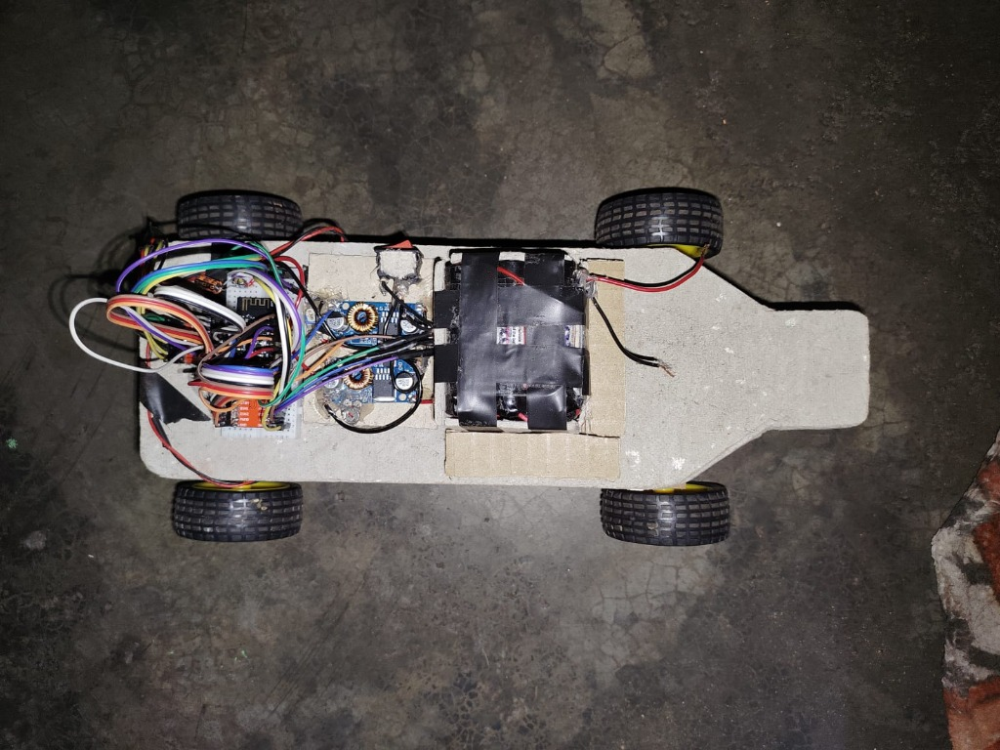
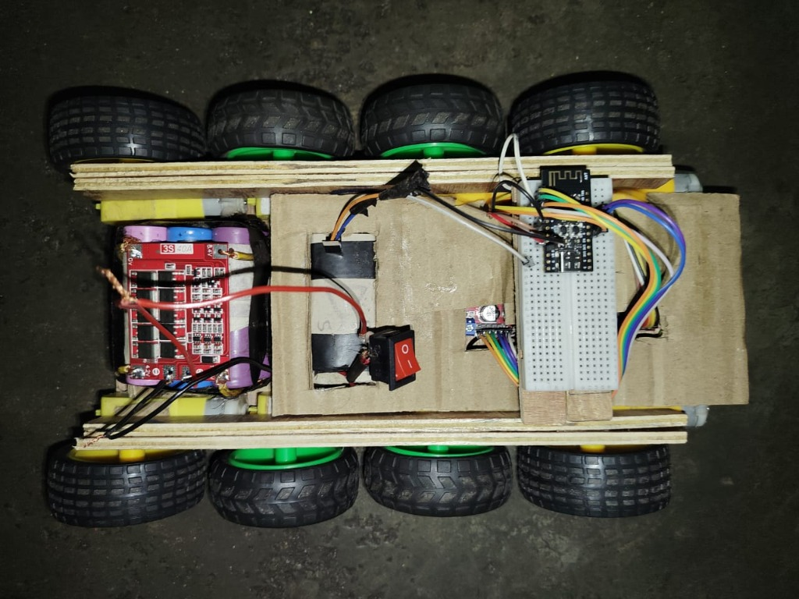
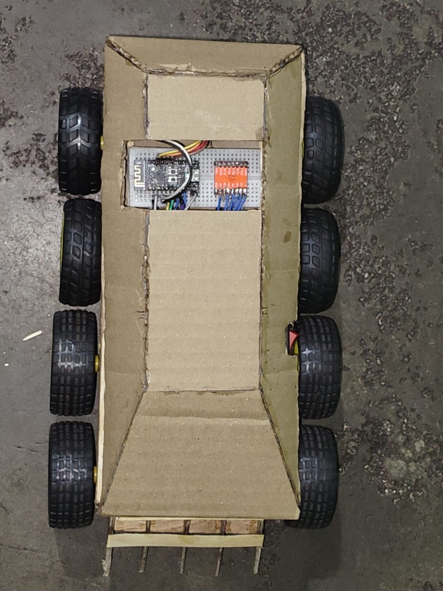
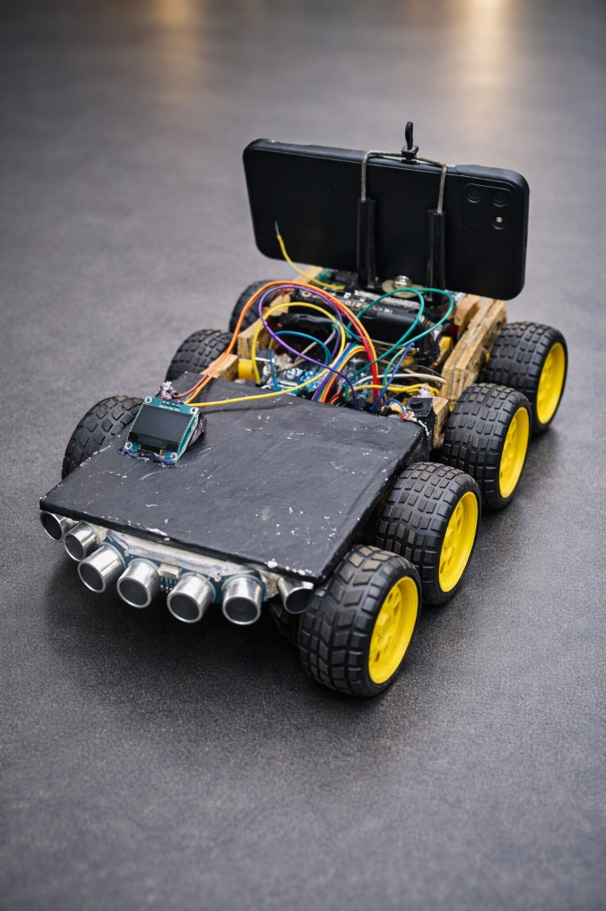
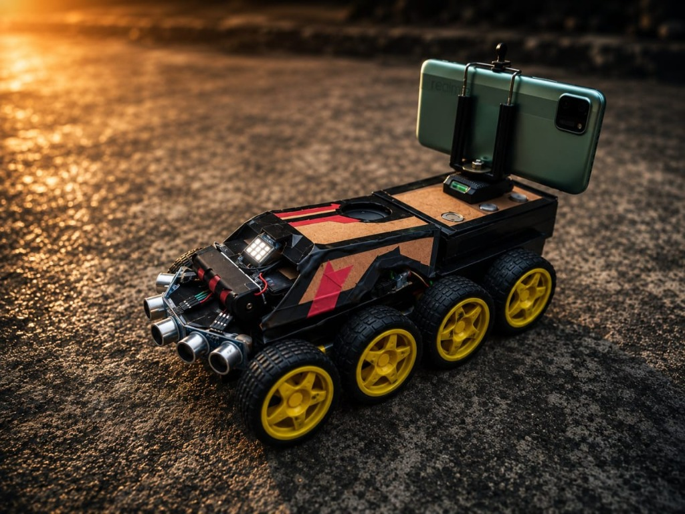

# 📜 CyberRover — Complete Development History & Engineering Journey

> **Project Origin**: Conceived & engineered in **Katras, Dhanbad, Jharkhand, India**  
> **Lead Creator & Solo Architect**: **Veer Pratap Saw** ([Portfolio Website](https://veerpratapsaw.vercel.app/))  
> **Key Collaborator (X2 – X3)**: **Om Ashutosh**  
> **Total R&D Time Investment**: **850+ Hands-On Engineering Hours**  
> **Total 1-Year Financial Investment**: **₹27,000 – ₹30,000+ INR** (₹12k+ Active Build + ₹5k+ Learning Losses + ₹8k–10k Lab Tools)  
> **Milestone Accolades**: 🥇 **Gold Medal / 1st Prize** (School Exhibition) | 🏆 **2nd Prize** (School RoboFight) | 🏆 **2nd Prize** (BIT Sindri) | 🏆 **3rd Prize** (BIT Sindri)  

---

## 🧭 Executive Summary: The True Story Behind CyberRover

The CyberRover platform did not begin as an environmental disaster reconnaissance robot. It was born out of a student's relentless curiosity, hands-on experimentation, competitive robotics battles, and collegiate exhibitions. 

What began in **October 2025** as an ambitious (and ultimately failed) attempt to build an ultrasonic 2D LiDAR room-mapping vehicle transformed across **five distinct generations** (X1, X2, X3, X4, and X4.2) into a distributed, multi-microcontroller hazardous inspection ground platform.

```
Oct 2025                 Jan 2026                 Apr 2026                Jun 2026                Aug - Sep 2026
   │                        │                        │                       │                          │
   ▼                        ▼                        ▼                       ▼                          ▼
[ 4WD LiDAR Idea ] ──► [ CyberRover X1 ] ──► [ CyberRover X2 ] ──► [ CyberRover X3 ] ──► [ CyberRover X4 & X4.2 ]
  Failed 2D room scan;   8WD Combat car;          BIT Sindri 1st visit;   BIT Sindri 2nd visit;   Total redesign; 4WD 37GB;
  TB6612FNG + 4 TT;      Uno + S3 + 2x L298N;     Om Ashutosh joins;      YOLO AI Object Vision;  Dual 43A BTS7960; ESP-NOW
  Solo by Veer           🏆 2nd Prize RoboFight   MQ Gas Telemetry;       Laptop TTS Voice Alerts; Handheld Remote; Solo by Veer
  (300+ Hours)           (Part of 300+ hrs)       🏆 2nd Prize BIT Sindri 🏆 3rd Prize BIT Sindri  🥇 GOLD MEDAL School Exhibition
                                                  (150+ Hours)            (100+ Hours)            (250+ hrs X4 + 50 hrs X4.2)
```

---

## 🛠️ Detailed Chronological Evolution

### Phase 0: The Failed 2D Ultrasonic Room Scanner (October 2025)

* **The Vision**: The initial concept was to build a compact 4WD robotic car capable of scanning an entire room in a 2D Cartesian grid map, simulating a low-cost LiDAR using ultrasonic transducers.
* **Initial Hardware**:
  * 4WD cardboard and plywood chassis with a narrowed nose.
  * 4x Yellow TT DC gearmotors.
  * Dual **TB6612FNG** dual-H-bridge motor drivers.
  * ESP32 microcontroller and custom breadboard wiring.
  * 3S Li-ion battery pack with DC-DC buck converter.
* **The Failure**:
  * Ultrasonic sound waves spread in a 15° cone, reflecting unpredictably off angled walls, curtains, and furniture.
  * Attempting to generate a coherent 2D occupancy grid with acoustic sensors proved physically impossible without optical LiDAR.
* **The Pivot**: Rather than abandoning the chassis, an upcoming school robotics competition provided the catalyst for an aggressive redesign.


*Figure 1: The earliest 4WD prototype chassis with dual TB6612FNG drivers, ESP32, and taped battery pack.*

---

### Phase 1: CyberRover X1 — The 8WD RoboFight Warrior (October 2025 – January 2026)

* **Context**: A school RoboFight combat robotics competition was announced for **January 2026**. Veer Pratap Saw began intensive preparation in October 2025.
* **Chassis Overhaul**:
  * Added 4 additional motors and wheels to upgrade the chassis from 4WD to a massive **8WD** configuration to maximize floor contact area and pushing torque in the combat ring.
  * Integrated **dual L298N motor drivers** driven by an **Arduino Uno** for direct PWM drive and an **ESP32-S3**.
  * Fabricated an angled combat armor shell from layered cardboard and reinforced plywood, complete with a front-mounted spiked battle wedge / ramp.
  * Upgraded power distribution with a heavy-duty **3S 40A BMS Li-ion battery pack** and high-current rocker switch.
* **Team Name**: **Cyber Rover**
* **Competition Result**: 🏆 **Won 2nd Prize** in the school RoboFight tournament!
* **Hours Invested**: **300+ Hours** across development and battle testing.

| Internal 8WD Chassis | Battle-Ready CyberRover X1 |
| :---: | :---: |
|  |  |
| *Figure 2: Interior of 8WD chassis with 3S 40A BMS and breadboard.* | *Figure 3: CyberRover X1 combat armor shell with front battle ramp.* |

---

### Phase 2: CyberRover X2 — BIT Sindri Exhibition & Gas Sensing (February – April 2026)

* **Context**: Following the RoboFight success, Veer received an invitation to showcase robotics at an exhibition hosted at the prestigious **BIT Sindri** engineering institution in April 2026.
* **Team Expansion**: Classmate and friend **Om Ashutosh** joined the project as a co-developer, collaborating through the X2 and X3 models.
* **Reconnaissance Transformation**:
  * Pivoted the platform from combat to hazardous inspection and environmental reconnaissance.
  * Installed **MQ series metal-oxide gas sensors** to detect hazardous combustible and toxic gases, routing raw analog streams to a ground station laptop.
  * Installed a forward-angled **0.96" OLED display** on a flat matte-black front deck.
  * Mounted a curved array of **3x HC-SR04 ultrasonic transceivers** for forward sonar coverage.
  * Mounted a smartphone on the rear deck to provide an elevated video vantage point.
* **Elimination of Wi-Fi Phone Control**:
  * Early experiments attempting to steer the car via a smartphone Wi-Fi hotspot suffered severe latency (packet queues, latency spikes over 800ms), causing erratic driving and near collisions. Phone Wi-Fi driving was permanently abandoned.
* **Exhibition Result**: 🏆 **Won 2nd Prize** at the BIT Sindri Exhibition!
* **Hours Invested**: **150+ Hours**.


*Figure 4: CyberRover X2 featuring 8WD drive, front curved ultrasonic array, OLED display, and smartphone mount at BIT Sindri.*

---

### Phase 3: CyberRover X3 — YOLO AI Object Detection & Voice (May – June 2026)

* **Context**: In June 2026, the team returned to **BIT Sindri** for a second competitive exhibition with substantial AI and vision upgrades.
* **Major Innovations**:
  * **Smartphone Camera + YOLO Object Detection**: The mounted smartphone streamed live video to a ground laptop running a **YOLO (You Only Look Once)** deep-learning object recognition model in real time.
  * **Text-to-Speech (TTS) Acoustic Feedback**: When the YOLO neural network identified obstacles, persons, or hazard markers, the ground station computer audibly announced the identified objects aloud via voice synthesis.
  * **Autonomous Ultrasonic Navigation**: Integrated autonomous driving routines using the 3 frontal ultrasonic sensors to steer away from obstacles without human intervention.
  * **Refined Aesthetics**: Sleek matte-black bodywork with red racing stripes, illuminated indicator LEDs, and an integrated smartphone tripod mount.
* **Exhibition Result**: 🏆 **Won 3rd Prize** at the BIT Sindri Exhibition!
* **Hours Invested**: **100+ Hours**.


*Figure 5: CyberRover X3 with real-time smartphone YOLO vision, voice synthesis, autonomous sonar steering, and combat racing body.*

---

### The Engineering Impasse: Why the 8WD Platform Had to Be Abandoned

Despite multiple exhibition awards, thorough field trials revealed three critical architectural bottlenecks with the X3 platform:

1. **Torque Deficit**: The lightweight yellow TT BO gearmotors produced insufficient torque for slopes, thick carpet, or uneven ground, frequently stalling under the vehicle's increasing weight.
2. **Rigid 8WD Suspension Incompatibility**: On uneven or rough terrain, the rigid 8WD chassis caused middle or outer wheels to hang in mid-air ("wheel lift-off"), losing ground contact and stalling progress.
3. **Control Paradigm**: Operating solely autonomously without a direct, deterministic, zero-lag manual teleoperation link made field recovery dangerous in confined spaces.

---

### Phase 4: CyberRover X4 — The Heavy-Duty 4WD Redesign (July – August 2026)

* **Context**: After the June 2026 BIT Sindri exhibition, Om Ashutosh's collaboration concluded. Veer Pratap Saw returned to solo development to engineer a completely revamped, production-grade architecture.
* **Total Chassis & Powertrain Redesign**:
  * Abandoned the 8WD TT motor setup entirely.
  * Engineered a high-traction, wide-stance **4WD platform** powered by four industrial **37GB geared 12V DC motors**, delivering massive torque and zero-slip skid steering.
  * Replaced low-current motor drivers with dual **BTS7960 43A MOSFET H-bridges**, capable of handling 86A total peak current without overheating.
* **Deterministic Handheld Teleoperation (ESP-NOW)**:
  * Handcrafted an ergonomic dual-grip remote controller from MDF and cardboard.
  * Implemented an **ESP-NOW 2.4 GHz peer-to-peer radio link** operating at 100 Hz, achieving sub-30ms latency with zero reliance on Wi-Fi routers.
  * Programmed **Cyber OS** on the remote with an animated Panther boot logo, real-time joystick calibration, and SSD1306 OLED HUD.
* **Distributed Multi-Microcontroller Architecture**:
  * **Node 01**: ESP32 Handheld Remote Controller.
  * **Node 02**: ESP32-S3 Rover Master (Radio gateway & command dispatcher).
  * **Node 03**: Arduino Uno (BTS7960 PWM control, 3x sonar radar, piezo acoustic alert).
  * **Node 04**: Arduino Nano (MQ-4, MQ-7, MQ-135 gas acquisition & 16x2 I2C LCD).
  * **Node 05**: ESP32-CAM (Wi-Fi telemetry server, DHT11, BMP280, tactical searchlight).
* **Hours Invested**: **250+ Hours**.

---

### Phase 5: CyberRover X4.2, Exhibition Gold Medal & Open-Source Release (August – September 2026)

* **School Exhibition Triumph**:
  * Presented the fully completed **CyberRover X4** at the major School Science & Robotics Exhibition in Katras, Dhanbad.
  * Demonstrated live zero-latency teleoperation, instant emergency braking, real-time gas hazard detection, and autonomous ultrasonic obstacle escape.
  * **Accolade**: 🥇 **Won 1st Prize & the Gold Medal**!
* **Refinement & Open-Source Documentation (X4.2)**:
  * Calibrated analog sensor voltage dividers and isolated the 5V/3.3V logic levels.
  * Developed the ground cockpit web dashboard with 6-channel Bézier oscilloscope telemetry.
  * Created the React 19 + Vite interactive showcase web application.
  * Authored complete open-source documentation: text-based `WIRING.md`, itemized `BOM.md`, transparent `COST_ESTIMATE.md`, and multi-license framework.
* **Hours Invested**: **50+ Hours**.
* **Total Cumulative R&D Effort**: **850+ Hours**.

---

## ⏱️ Development Hours & Accolades Summary

| Milestone / Version | Timeline | Team Dynamics | Core Innovations | R&D Effort | Recognition |
| :--- | :--- | :--- | :--- | :---: | :--- |
| **Initial 4WD Prototype** | Oct 2025 | Veer Pratap Saw (Solo) | 2D Ultrasonic room mapping, TB6612FNG, 4 TT motors | ~120 hrs | Educational Proof-of-Concept |
| **CyberRover X1** | Oct 2025 – Jan 2026 | Veer Pratap Saw (Solo) | 8WD conversion, combat armor, Uno + ESP32-S3 + L298N | ~180 hrs | 🏆 **2nd Prize** (School RoboFight) |
| **CyberRover X2** | Feb – Apr 2026 | Veer Pratap Saw & Om Ashutosh | MQ Gas sensors, telemetry to laptop, removed laggy Wi-Fi | 150+ hrs | 🏆 **2nd Prize** (BIT Sindri Exhibition) |
| **CyberRover X3** | May – Jun 2026 | Veer Pratap Saw & Om Ashutosh | Smartphone YOLO AI vision, voice synthesis, auto sonar | 100+ hrs | 🏆 **3rd Prize** (BIT Sindri Exhibition) |
| **CyberRover X4** | Jul – Aug 2026 | Veer Pratap Saw (Solo) | 4WD 37GB motors, dual 43A BTS7960, ESP-NOW remote HUD | 250+ hrs | 🥇 **1st Prize & Gold Medal** (School Exhibition) |
| **CyberRover X4.2** | Aug – Sep 2026 | Veer Pratap Saw (Solo) | Open source release, telemetry cockpit, showcase web app | 50+ hrs | Katras, Dhanbad Public Release |
| **TOTAL** | **Oct 2025 – Sep 2026** | — | **5 Vehicle Generations** | **850+ Hours** | **4 Major Competition Honors** |

---

## 💸 Total Financial Investment & R&D Accounting (~₹27,000 – ₹30,000 INR)

> [!IMPORTANT]
> Developing high-performance robotics indigenously requires significant real financial commitment. Over the course of the **1-year development cycle (October 2025 – September 2026)**, the creator personally invested **more than ₹27,000 to ₹30,000 INR** out of pocket across three distinct financial pillars:

```
┌──────────────────────────────────────────────────────────────────────────────────┐
│                   CUMULATIVE 1-YEAR FINANCIAL INVESTMENT BREAKDOWN               │
├────────────────────────────────────────────────────────┬─────────────────────────┤
│ Financial Pillar                                       │ Amount (INR)            │
├────────────────────────────────────────────────────────┼─────────────────────────┤
│ 1. Current Active CyberRover X4.2 Build Value          │              ₹12,000+   │
│ 2. Hands-On R&D, Prototype Iterations & Learning Losses│               ₹5,000+   │
│ 3. Dedicated Lab Tools, Soldering & Workshop Equipment │       ₹8,000 - ₹10,000  │
├────────────────────────────────────────────────────────┼─────────────────────────┤
│ TOTAL CUMULATIVE 1-YEAR EXPENDITURE                    │     ₹27,000 - ₹30,000+  │
│                                                        │      (~ $330 - $360 USD)│
└────────────────────────────────────────────────────────┴─────────────────────────┘
```

### 1. Active CyberRover X4.2 Hardware Value (~₹12,000+ INR)
* **Core Vehicle Electronics & Actuation**: 4x 37GB geared motors (₹1,600) + dual 43A BTS7960 drivers (₹800) + 4 microcontrollers (S3, Uno, Nano, CAM = ₹3,150) + full sensor suite (₹1,430) + 3S battery & buck converter (₹490) + wiring/fasteners (~₹300) = **₹7,530**.
* **Handmade Handheld Remote Controller**: ESP32 DevKit + 0.96" OLED + dual 2-axis joysticks + SPDT toggle switches + pushbuttons + dedicated Li-ion pack = **₹1,550**.
* **Structural Chassis, Fasteners & Hardware Overhead**: Custom multi-tier MDF chassis, brass standoffs, high-current XT30 connectors, traction rubber tires, battery balance charger, and smartphone mount = **~₹3,000+**.
* **Total Active Build Cost**: **₹12,000+ INR**.

### 2. Experimental Iteration & Learning Component Losses (~₹5,000+ INR)
In robotics, hands-on learning involves destruction. Components consumed and burned during trial and error across the X1, X2, and X3 builds include:
* Burned H-bridge MOSFETs and motor drivers during rapid forward-reverse stall current tests.
* Overvolted ESP32 boards prior to implementing 1kΩ/2kΩ resistive voltage dividers.
* Burned MQ gas sensor internal heating coils from unregulated voltage spikes.
* Blown DC-DC step-down buck converters from thermal over-current.
* Discarded prototype MDF cuts, wheel hub iterations, and cardboard armor shells.

### 3. Dedicated Workshop Tools & Lab Infrastructure (~₹8,000 – ₹10,000 INR)
To build, solder, calibrate, and troubleshoot 5 generations of rovers, the creator procured essential workshop equipment:
* Temperature-controlled soldering station, solder wire, flux, and desoldering pump.
* Digital multimeter with precision probes for voltage rail and current debugging.
* Automatic wire strippers, flush cutters, pliers, and crimping tools.
* High-power hot glue gun and industrial adhesive sticks.
* Precision screwdriver bit sets, drill bits, hand saws, and sanding tools.
* Bench power testing supply, breadboards, component organizers, and spare hardware kits.

---

## 🔗 Author & Portfolio

- **Creator & Lead Architect**: **Veer Pratap Saw**
- **Personal Portfolio**: [https://veerpratapsaw.vercel.app/](https://veerpratapsaw.vercel.app/) (Featuring CyberRover and additional frontend & engineering projects)
- **GitHub Profile**: [@veerpratapsaw-code](https://github.com/veerpratapsaw-code)
