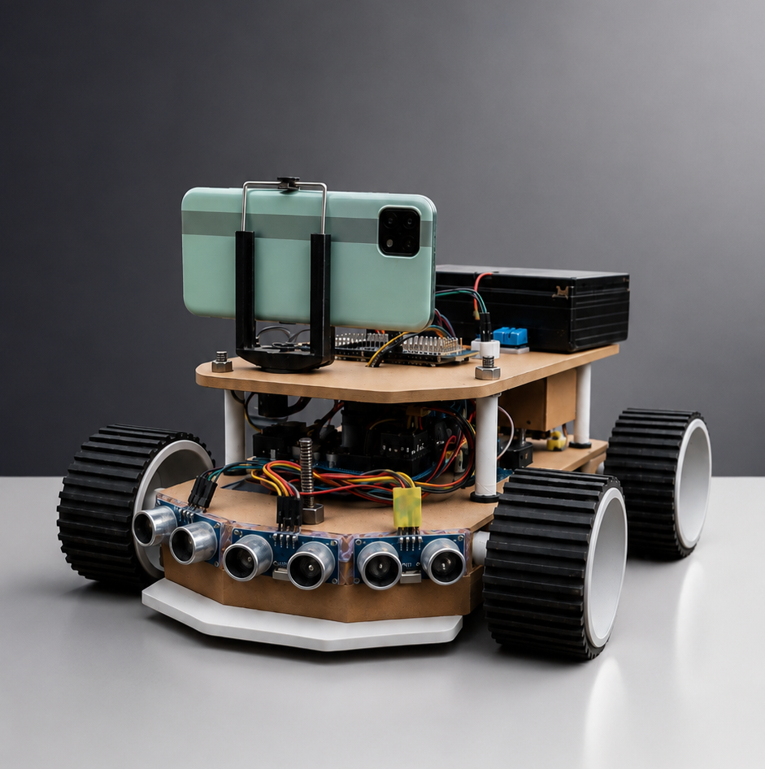
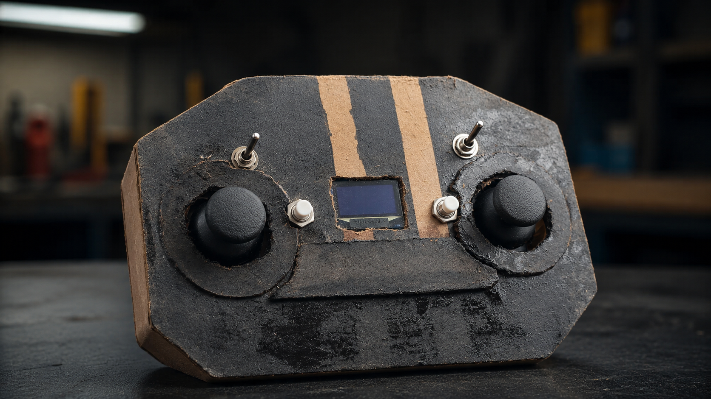

# CyberRover X4.2

### Remote Reconnaissance & Environmental Inspection Rover

[](LICENSE.md)
[](hardware/HARDWARE_OVERVIEW.md)
[](https://cyber-rover-x4.vercel.app/)
[](documentation/testing/TESTING.md)

---

> [!TIP]
> 🌐 **Official Interactive Showcase Website & Live Demo**:  
> Explore the 3D model, simulated telemetry oscilloscope, mission manifesto, and platform specs online:  
> 👉 **[https://cyber-rover-x4.vercel.app/](https://cyber-rover-x4.vercel.app/)**



---

## 📖 Table of Contents

- [Overview](#-overview)
- [Problem](#-problem)
- [Idea](#-idea)
- [Current Capabilities](#-current-capabilities)
- [System Architecture](#-system-architecture)
- [Rover Hardware](#-rover-hardware)
- [Remote Controller](#-remote-controller)
- [Environmental Sensing](#-environmental-sensing)
- [Obstacle Sensing](#-obstacle-sensing)
- [Camera System](#-camera-system)
- [Telemetry System](#-telemetry-system)
- [Ground Dashboard](#-ground-dashboard)
- [Data Flow](#-data-flow)
- [Repository Structure](#-repository-structure)
- [Bill of Materials (BOM)](#-bill-of-materials-bom)
- [Cost & Financials](#-cost--financials)
- [Wiring Reference](#-wiring-reference)
- [Testing & Verification](#-testing--verification)
- [Current Limitations](#-current-limitations)
- [Safety Disclaimers](#-safety-disclaimers)
- [Future Development](#-future-development)
- [CyberRover X5 Concept](#-cyberrover-x5-concept)
- [Project Website](#-project-website)
- [Contributing](#-contributing)
- [License](#-license)
- [Acknowledgements](#-acknowledgements)

---

## 🔭 Overview

The **CyberRover X4.2** is an open-source, multi-microcontroller ground robotics platform designed for remote environmental inspection, hazardous-area surveying, and disaster simulation. Developed in Hazaribagh, Jharkhand, India, the project demonstrates how low-cost commercial off-the-shelf (COTS) electronics—microcontrollers, metal-oxide gas sensors, ultrasonic transceivers, and an ergonomic handmade handheld controller—can be orchestrated into an effective, distributed teleoperation platform.

---

## 🛑 Problem

Confined underground tunnels, mining drifts, industrial storage ducts, and post-disaster disaster sites often accumulate fatal concentrations of combustible and toxic gases (such as methane and carbon monoxide) alongside sudden physical obstacles and complete structural darkness. Deploying human reconnaissance teams into these unverified spaces exposes personnel to severe risk of poisoning, asphyxiation, or structural collapse. Commercial industrial inspection rovers solve this problem but typically cost upwards of ₹2,00,000 to ₹10,00,000+ ($2,500 to $12,000+ USD), placing them out of reach for educational institutions, local emergency volunteers, and researchers in developing regions.

---

## 💡 Idea

The core concept behind CyberRover X4.2 is **distributed, decoupled edge intelligence**:
1. **Never tie real-time motor driving to high-bandwidth wireless networking.** If video transmission stalls or suffers network latency, vehicle steering must not freeze.
2. **Partition responsibilities across specialized, low-cost microcontrollers**:
   - High-speed wireless command parsing on an ESP32-S3.
   - Deterministic motor PWM generation and radar scanning on an Arduino Uno.
   - Dedicated analog gas acquisition on an Arduino Nano.
   - Web serving, camera capture, and telemetry broadcasting on an ESP32-CAM.
3. Provide the human operator with an intuitive, self-contained handheld remote featuring an onboard embedded HUD (Cyber OS).

---

## ⚡ Current Capabilities

- **4WD Skid-Steer Mobility**: High-torque 4-wheel drive capable of zero-radius tank pivots and rough terrain traversal.
- **Ultra-Low Latency Teleoperation**: 2.4 GHz ESP-NOW wireless link between handheld controller and rover (< 30 ms response).
- **Embedded Cyber OS HUD**: Real-time OLED heads-up display on the handheld remote showing drive mode, steering/throttle trim, and battery status.
- **Panoramic Ultrasonic Radar**: 3-sensor curved acoustic radar providing left, center, and right proximity detection.
- **Reactive Collision Avoidance**: Autonomous safety override that prevents frontal impacts and executes escape maneuvers when obstacles are detected.
- **Multi-Parameter Atmospheric Sensing**: Analog detection of Methane (MQ-4), Carbon Monoxide (MQ-7), and Air Contaminants (MQ-135).
- **Climate & Altimetry Logging**: Ambient temperature/humidity (DHT11) and barometric pressure/elevation tracking (BMP280).
- **Optical Inspection & Searchlight**: OV2640 camera streaming with remote-toggled high-power white LED searchlight for dark voids.
- **Tactical Laptop Cockpit**: Browser-based ground dashboard with threshold danger alerts and a live 6-channel Bézier oscilloscope.

---

## 🧭 System Architecture

The rover decouples all operations into two physically separated hardware layers:

```
┌─────────────────────────────────────────────────────────────────────────────┐
│                           CYBERROVER X4.2 TOPOLOGY                          │
├──────────────────────────────────────┬──────────────────────────────────────┤
│ 🏎️ LAYER 1: REAL-TIME DRIVE CORE     │ 📊 LAYER 2: TELEMETRY & OPTICAL      │
│    (Deterministic Zero-Latency)      │    (Asynchronous High-Bandwidth)     │
├──────────────────────────────────────┼──────────────────────────────────────┤
│ • Handheld Remote (ESP32 DevKit V1)  │ • Sensor Node (Arduino Nano V3)      │
│ • 2.4 GHz ESP-NOW Wireless Link      │ • Telemetry Hub (ESP32-CAM)          │
│ • Rover Master (ESP32-S3)            │ • MQ-4, MQ-7, MQ-135 Gas Array       │
│ • Motor & Radar Brain (Arduino Uno)  │ • DHT11 Climate + BMP280 Barometer   │
│ • Dual BTS7960 43A Motor Drivers     │ • Local 16x2 I2C Character LCD       │
│ • 3x HC-SR04 Obstacle Sonar Array    │ • Wi-Fi Web Server & Video Stream    │
│ • Tactical Piezo Sound Engine        │ • Ground Cockpit Web Dashboard       │
└──────────────────────────────────────┴──────────────────────────────────────┘
```

For complete architecture details, see [`documentation/architecture/PROJECT_ARCHITECTURE.md`](documentation/architecture/PROJECT_ARCHITECTURE.md).

---

## 🛠️ Rover Hardware

The rover is constructed on a multi-tier, hand-cut Medium-Density Fiberboard (MDF) chassis engineered for physical rigidity, electrical non-conductivity, and rapid modular servicing:
- **Actuation**: 4x Geared DC Motors running skid-steering tank drive.
- **Motor Drivers**: Dual BTS7960 43A H-Bridges running high-frequency PWM.
- **Compute Cluster**: ESP32-S3 (Rover Master), Arduino Uno R3 (Motor Brain), Arduino Nano V3 (Gas Node), ESP32-CAM (Telemetry Hub).
- **Local Display**: 16x2 HD44780 character LCD with PCF8574 I2C backpack.
- **Power Rail**: 3S Li-ion battery pack (9.6V–12.6V) with high-efficiency step-down DC-DC buck converter (5.0V regulated logic supply).

For full hardware specifications, see [`hardware/HARDWARE_OVERVIEW.md`](hardware/HARDWARE_OVERVIEW.md) and [`hardware/MECHANICAL_DESIGN.md`](hardware/MECHANICAL_DESIGN.md).

---

## 🕹️ Remote Controller

The handheld remote controller is an authentic handmade prototype featuring an ergonomic hand-cut body, dual analog thumbsticks, industrial toggle switches, and tactile pushbuttons.



### Key Features:
- **Brain**: Espressif ESP32 DevKit V1 operating 2.4 GHz ESP-NOW protocol.
- **Cyber OS HUD**: 0.96" SSD1306 OLED (128x64) displaying driving speed, steering indicators, drive mode, and battery level.
- **Controls Layout**:
  - *Left Stick*: Forward/Reverse throttle and Left/Right steering.
  - *Right Stick*: Navigation and speed trim.
  - *Push Button P1*: Horn / Save settings to non-volatile flash.
  - *Push Button P2*: Toggle Manual Mode $\leftrightarrow$ Auto Obstacle-Avoidance Assist.
  - *Toggle Switch T1*: Flip between Live Driving HUD and Cyber OS Menu.
  - *Toggle Switch T2*: Instant Master Parking Brake.

For complete firmware and controls, see [`controller/remote-controller/README.md`](controller/remote-controller/README.md).

---

## 🔬 Environmental Sensing

The rover carries a dedicated atmospheric sensor suite:
- **MQ-4**: Sensitive to methane ($\text{CH}_4$) and natural gas.
- **MQ-7**: Sensitive to carbon monoxide ($\text{CO}$).
- **MQ-135**: Sensitive to general air quality, ammonia, and smoke contaminants.
- **DHT11**: Ambient temperature (0–50°C) and relative humidity (20–90% RH).
- **BMP280**: Atmospheric barometric pressure (hPa) and altitude trend tracking.

For sensor details, see [`documentation/sensors/environmental_sensors.md`](documentation/sensors/environmental_sensors.md).

---

## 🦇 Obstacle Sensing

Three HC-SR04 ultrasonic transceivers are positioned in an arc across the front bumper:
- **Left Sensor** (-45°): Detects side obstacles and narrow walls.
- **Center Sensor** (0°): Detects forward head-on obstructions.
- **Right Sensor** (+45°): Detects right-side boundaries.

In **Auto Assist Mode**, the rover autonomously intervenes to prevent collisions, reversing and steering away from obstacles closer than 20–25 cm. See [`documentation/sensors/obstacle_sensing.md`](documentation/sensors/obstacle_sensing.md).

---

## 📷 Camera System

- **Sensor**: OmniVision OV2640 2MP CMOS sensor with fixed-focus lens on an AI-Thinker ESP32-CAM module.
- **Memory**: 4MB external PSRAM provides smooth DMA framebuffer allocation.
- **Searchlight**: Integrated high-intensity white power LED on GPIO 4 remotely controllable via dashboard shortcut `T`.
- See [`documentation/sensors/camera_system.md`](documentation/sensors/camera_system.md).

---

## 📡 Telemetry System

The Arduino Nano packages gas readings and transmits them over a 3.3V level-shifted serial link to the ESP32-CAM. The ESP32-CAM aggregates these readings with DHT11 and BMP280 data and exposes an HTTP JSON endpoint `/telemetry` accessed by the ground station at 4 Hz.

---

## 💻 Ground Dashboard

The ground dashboard is a tactical, browser-based web application running on operator laptops or tablets without requiring internet access:
- Double-click [`software/ground-dashboard/start_dashboard.bat`](software/ground-dashboard/start_dashboard.bat) or open `index.html`.
- Displays real-time numerical readings, threshold danger alerts, and a **6-Channel Bézier Oscilloscope** graphing atmospheric data.
- See [`software/ground-dashboard/README.md`](software/ground-dashboard/README.md).

---

## 🔄 Data Flow

```
[ Handheld Remote (ESP32) ]
            │ 2.4 GHz ESP-NOW (~20 Hz)
            ▼
[ Rover Master (ESP32-S3) ]
            │ UART @ 38400 baud (9-byte CyberPacket)
            ▼
[ Motor Controller (Uno) ] ──► [ Dual BTS7960 ] ──► [ 4WD Motors ]
            ▲
            │ Sonar Echo Pulses
[ 3x HC-SR04 Sonar Array ]

[ Gas Sensors (MQ-4, 7, 135) ]
            │ Analog Voltages (A0, A1, A2)
            ▼
[ Sensor Node (Nano) ] ──► [ 16x2 Local LCD ]
            │ UART @ 115200 baud (via 3.3V Level Divider)
            ▼
[ Telemetry Hub (ESP32-CAM) ] ◄── [ DHT11 & BMP280 ]
            │ Wi-Fi HTTP (Port 80)
            ▼
[ Laptop Ground Dashboard / Web Browser ]
```

---

## 🗂️ Repository Structure

```
CYBERROVER-X4/
├── README.md                      # Primary repository overview (this document)
├── LICENSE                        # Multi-license summary
├── LICENSE.md                     # Comprehensive legal terms & third-party notices
├── CONTRIBUTING.md                # Contribution workflow & rules
├── CODE_OF_CONDUCT.md             # Contributor covenant standards
├── SECURITY.md                    # Security policy & credential handling
├── CHANGELOG.md                   # Chronological version history
├── CURRENT_STATUS.md              # Detailed implementation status & non-claims
├── ROADMAP.md                     # Past milestones & development roadmap
├── DEVELOPMENT_HISTORY.md         # Origin, prototyping phases & R&D accounting
├── THIRD_PARTY.md                 # Upstream software & library attributions
├── REPOSITORY_INDEX.md            # Comprehensive repository directory index
├── OPEN_SOURCE_AUDIT_REPORT.md    # Pre-release audit & compliance verification
├── .gitignore                     # Git exclusion rules
├── .env.example                   # Local environment & Wi-Fi configuration template
│
├── controller/                    # Handheld teleoperation remote firmware & Cyber OS
├── firmware/                      # Onboard MCU firmware (ESP32-S3, Uno, Nano, CAM)
├── software/                      # Tactical browser ground cockpit dashboard
├── hardware/                      # BOM, cost estimate, overview, power, wiring Markdown
├── tools/                         # Standalone hardware diagnostic suites
├── documentation/                 # Architecture, sensors, testing, safety, exhibition
├── media/                         # Authentic photos, videos, and figures
├── future/                        # Conceptual CyberRover X5 future deep-mine platform
└── website/                       # React 19 + Vite presentation showcase web app
```

---

## 📦 Bill of Materials (BOM)

A concise summary of the functional vehicle electronics:

| Component | Qty | Unit Price (₹) | Total (₹) | Role |
| :--- | :---: | :---: | :---: | :--- |
| **Geared DC Motors** | 4 | ₹400 | ₹1,600 | 4WD motive propulsion |
| **BTS7960 Motor Drivers** | 2 | ₹400 | ₹800 | 43A High-power H-bridges |
| **ESP32-S3 DevKit** | 1 | ₹1,600 | ₹1,600 | Rover Master; ESP-NOW receiver |
| **Arduino Uno R3** | 1 | ₹450 | ₹450 | Motor brain & radar controller |
| **Arduino Nano V3** | 1 | ₹250 | ₹250 | Gas sensor acquisition node |
| **ESP32-CAM Module** | 1 | ₹850 | ₹850 | Telemetry hub & video streaming |
| **HC-SR04 Sonar Array** | 3 | ₹200 | ₹600 | Panoramic obstacle radar |
| **MQ Gas Sensors (4, 7, 135)**| 3 | ₹200 | ₹600 | Methane, CO, Air Quality |
| **DHT11 Climate Sensor** | 1 | ₹50 | ₹50 | Ambient temperature & humidity |
| **BMP280 Barometer** | 1 | ₹180 | ₹180 | Atmospheric pressure & altitude |
| **16x2 I2C Character LCD** | 1 | ₹300 | ₹300 | Local gas concentration display |
| **Acoustic Siren / Buzzer** | 1 | ₹50 | ₹50 | Tactical warning sound engine |
| **3S Li-ion Battery Pack** | 1 | ₹350 | ₹350 | Rover high-current motive supply |
| **DC-DC Step-Down Buck** | 1 | ₹140 | ₹140 | 5.0V regulated logic power rail |
| **Jumper Wires & Wiring** | 1 Lot | ~₹300 | ₹300 | Interconnects and power leads |
| **VEHICLE ELECTRONICS SUBTOTAL** | | | **₹7,530** | |

For the full breakdown including remote controller items and mechanical hardware, see [`hardware/BOM.md`](hardware/BOM.md).

---

## 💰 Cost & Financials

```
┌────────────────────────────────────────────────────────┐
│               PROTOTYPE FINANCIAL OVERVIEW             │
├───────────────────────────────────┬────────────────────┤
│ Functional Vehicle Electronics    │             ₹7,530 │
│ Handheld Remote Electronics       │             ₹1,550 │
│ Estimated Structural Hardware     │            ~₹1,200 │
├───────────────────────────────────┼────────────────────┤
│ UNIT REPLICATION BUILD COST       │   ~₹10,000 - 11,000│
├───────────────────────────────────┼────────────────────┤
│ Separate R&D / Learning Loss      │           > ₹5,000 │
└───────────────────────────────────┴────────────────────┘
```

> [!IMPORTANT]
> The project owner incurred **over ₹5,000 in material losses** during hands-on learning (burned motor drivers, overvolted microcontrollers, damaged sensor heating coils, and scrap chassis cuts). In accordance with accounting best practices, this is documented separately and is **NOT** added to the unit replication BOM. See [`hardware/COST_ESTIMATE.md`](hardware/COST_ESTIMATE.md).

---

## ⚡ Wiring Reference

> [!IMPORTANT]
> **NO GRAPHICAL DIAGRAM NOTICE**: Per engineering release guidelines, all connections, logic level conversions, and power distribution rules are documented strictly in structured Markdown tables.
> 👉 **Complete Manual**: [`hardware/WIRING.md`](hardware/WIRING.md)

### Critical Connection Summary:
- **Common Ground**: All 4 microcontrollers, motor drivers, and sensors share a unified ground bus.
- **Level Shifting**: Arduino Nano Pin D1 (5V TX) connects to ESP32-CAM GPIO 13 (3.3V RX) through a **1kΩ / 2kΩ resistive voltage divider**.
- **Power Rails**: Motors run directly from unregulated 3S battery (9.6V–12.6V); all logic boards run from the regulated 5.0V buck rail.

---

## 🧪 Testing & Verification

- **Mobility**: Skid-steer driving, forward/reverse, and 360° tank pivots verified on indoor floors and dry terrain.
- **Teleoperation**: ESP-NOW control verified with instantaneous response (< 30ms latency); master parking brake immediately stops motors.
- **Avoidance**: Auto Assist mode verified to autonomously detect obstacles and execute evasive maneuvers.
- **Telemetry**: Real-time 4 Hz JSON telemetry polling verified on Ground Dashboard.
- **Photographic & Video Log**: Available in [`documentation/testing/TESTING.md`](documentation/testing/TESTING.md).

---

## ⚠️ Current Limitations

- **Gas Sensor Accuracy**: MQ sensors produce relative analog resistance values; they are **uncalibrated** and cannot provide certified PPM measurements.
- **Acoustic Absorption**: HC-SR04 sonar waves can be absorbed by soft cloth or deflected by angled smooth surfaces.
- **Chassis Weatherproofing**: Open MDF construction (IP00 rating); not waterproof and vulnerable to wet or flooded terrain.
- **RF Attenuation**: 2.4 GHz signals degrade significantly through dense soil, wet rock, or reinforced concrete.
- See [`documentation/sensors/sensor_limitations.md`](documentation/sensors/sensor_limitations.md).

---

## 🛡️ Safety Disclaimers

> [!CAUTION]
> **RESEARCH & EDUCATIONAL PROTOTYPE ONLY**:
> The CyberRover X4.2 is explicitly **NOT certified** for:
> - Underground coal or metal mines
> - Explosive atmospheres (ATEX / IECEx Zone 0/1/2)
> - Hazardous chemical spill zones or structural search-and-rescue
> - Life-critical operations
> 
> Brushed DC motors, mechanical switches, and heated MQ sensor coils can produce sparks and hot surfaces capable of igniting flammable gases. See [`documentation/safety/SAFETY.md`](documentation/safety/SAFETY.md).

---

## 🚀 Future Development

Near-term plans for the X4.x platform include:
- Designing unified PCB breakout shields to eliminate jumper wire clutter.
- Integrating precision NDIR optical gas sensors.
- Adding Time-of-Flight (ToF) laser ranging sensors.
- See [`ROADMAP.md`](ROADMAP.md).

---

## 🔮 CyberRover X5 Concept

The **CyberRover X5** is a separate, long-term conceptual vision (2026–2028+) exploring an explosion-proof (ATEX), submersible, fiber-tethered deep-mine inspection platform. 

> [!WARNING]
> None of the capabilities of CyberRover X5 apply to the current physical X4.2 prototype. The X5 engineering documents are archived strictly in [`future/cyberrover-x5/`](future/cyberrover-x5/).

---

## 🌐 Project Website

An interactive presentation web application demonstrating the rover's systems is live at:
🔗 **[https://cyber-rover-x4.vercel.app/](https://cyber-rover-x4.vercel.app/)**

*(Note: The link is provided as a live project showcase on free-tier hosting; permanent uptime is not guaranteed. The source code is preserved in [`website/`](website/)).*

---

## 🤝 Contributing

We welcome contributions, bug fixes, and documentation improvements! Please review [`CONTRIBUTING.md`](CONTRIBUTING.md) and [`CODE_OF_CONDUCT.md`](CODE_OF_CONDUCT.md) before submitting pull requests.

---

## 📄 License

The CyberRover X4.2 project is released under a transparent multi-licensing model:
- **Software & Firmware**: [MIT License](LICENSES/MIT.txt)
- **Hardware Schematics & Wiring**: [CERN-OHL-S-2.0](LICENSES/CERN-OHL-S-2.0.txt)
- **Documentation & Visual Media**: [Creative Commons Attribution 4.0 International (CC BY 4.0)](LICENSES/CC-BY-4.0.txt)

See [`LICENSE.md`](LICENSE.md) and [`THIRD_PARTY.md`](THIRD_PARTY.md) for full details.

---

## 🙏 Acknowledgements

- Developed by the robotics engineering team in **Hazaribagh, Jharkhand, India**.
- Winning project presented at the regional science exhibition ([Speech Transcript](documentation/exhibition/HAZARIBAGH_EXHIBITION_WINNING_SPEECH.md)).
- Grateful appreciation to the global Arduino, Espressif, and open-source robotics communities for developing foundational open hardware and libraries.
