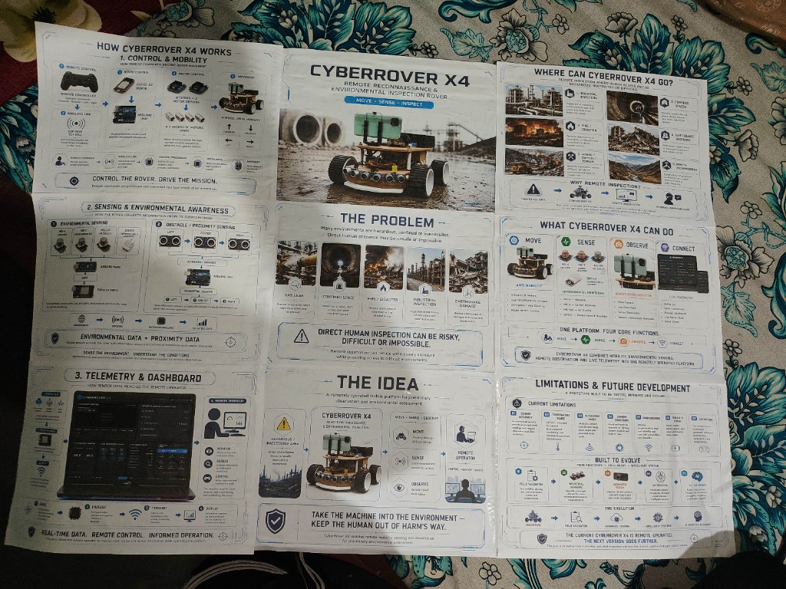

# 🏆 Project Exhibition & Presentation Archives

This directory preserves the authentic presentation boards, printable technical brochures, and competition speech documentation from public exhibitions where the **CyberRover X4.2** was demonstrated.

---

## 📁 Exhibition Contents

### 1. Presentation Posters (`posters/`)

*Figure 1: Authentic 9-panel printed exhibition poster sheet as displayed during presentation preparation for the School Science & Robotics Exhibition in Katras, Dhanbad.*

This directory preserves both the full printed 9-panel composite sheet ([`exhibition_printed_poster_composite.jpg`](posters/exhibition_printed_poster_composite.jpg)) and the 9 individual high-resolution panels ([`poster_panel_01.png`](posters/poster_panel_01.png) through [`poster_panel_09.png`](posters/poster_panel_09.png)) prepared for exhibition display stands:
- **Panel 01**: Control & Mobility (ESP-NOW remote, dual BTS7960, 4WD motors)
- **Panel 02**: Mission Hero (CyberRover X4 overview, Move · Sense · Inspect)
- **Panel 03**: Operational Environments (Hazardous zones, confined spaces, disaster areas)
- **Panel 04**: Sensing & Environmental Awareness (MQ gas sensor cluster, ultrasonic radar array)
- **Panel 05**: The Problem (Direct human presence risks in toxic & confined spaces)
- **Panel 06**: Capabilities Matrix (Move, Sense, Observe, Connect)
- **Panel 07**: Telemetry & Dashboard (Ground cockpit software, 60 FPS oscilloscope)
- **Panel 08**: The Idea (Remote reconnaissance paradigm — keeping humans out of harm's way)
- **Panel 09**: Limitations & Future Development (Current boundaries, evolutionary path to X5)

### 2. Technical Handouts (`handouts/`)
- [`part-1.pdf`](handouts/part-1.pdf) & [`part-1_alt.pdf`](handouts/part-1_alt.pdf): Comprehensive project overview brochure.
- [`part-2.pdf`](handouts/part-2.pdf) & [`part-2_alt.pdf`](handouts/part-2_alt.pdf): Electrical specifications, sensor descriptions, and subsystem breakdowns.

### 3. Exhibition Speech
- [`DHANBAD_EXHIBITION_SPEECH.md`](DHANBAD_EXHIBITION_SPEECH.md): Verbatim transcript of the 1st Prize Gold Medal winning project presentation delivered for CyberRover X4 at the School Science & Robotics Exhibition in Katras, Dhanbad.
