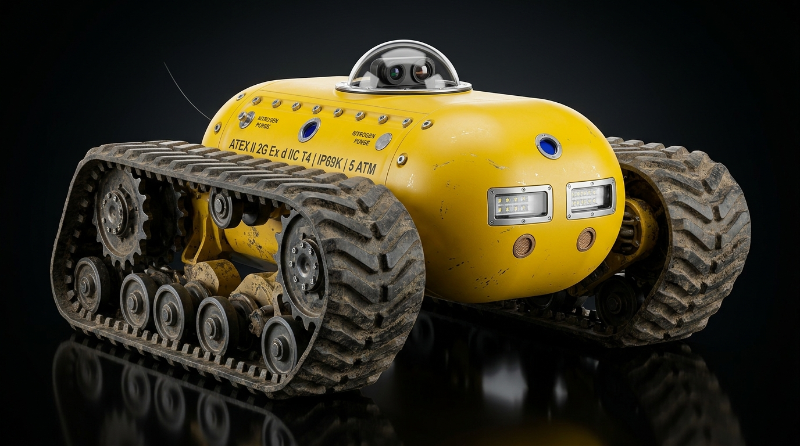

# 🤖 CYBERROVER X5 — COMPLETE ENGINEERING DESIGN DOCUMENT
### Explosion-Proof, Underwater-Capable, Fiber-Tethered Deep Mine Reconnaissance Platform



**Project:** CyberRover X5 Deep Recon Edition  
**Team:** RBOTICS | Katras, Dhanbad, Jharkhand, India  
**Predecessor:** CyberRover X4.2 (Current Working Prototype)  
**Target Build:** 2026–2028  

---

## 📋 TABLE OF CONTENTS

1. [Mission & Target Environments](#-1-mission--target-environments)
2. [Design Philosophy](#-2-design-philosophy)
3. [Chassis & Mobility](#-3-chassis--mobility)
4. [Hull & Pressure Vessel](#-4-hull--pressure-vessel)
5. [Power System](#-5-power-system)
6. [Communication System (Tri-Mode)](#-6-communication-system-tri-mode)
7. [Sensor Suite](#-7-sensor-suite)
8. [Gas Analysis System (Internal Chamber)](#-8-gas-analysis-system-internal-chamber)
9. [Vision System (Camera + LIDAR)](#-9-vision-system-camera--lidar)
10. [Computing & Software Stack](#-10-computing--software-stack)
11. [Lighting System](#-11-lighting-system)
12. [Explosion Proofing (ATEX)](#-12-explosion-proofing-atex)
13. [Underwater Operations (3–4m Walker)](#-13-underwater-operations-34m-walker)
14. [Anti-Flip Design (No Flippers Needed)](#-14-anti-flip-design-no-flippers-needed)
15. [Safety & Emergency Systems](#-15-safety--emergency-systems)
16. [All 17 Problems Identified & Solved](#-16-all-17-problems-identified--solved)
17. [Complete Budget Breakdown (₹)](#-17-complete-budget-breakdown-)
18. [Build Roadmap & Phases](#-18-build-roadmap--phases)
19. [Final Specifications Summary](#-19-final-specifications-summary)

---

## 🎯 1. Mission & Target Environments

The CyberRover X5 is designed to operate in environments where **no human should go** and **no normal robot can survive**. It replaces human mine inspectors, disaster responders, and hazard surveyors.

| Environment | Hazards Present | How X5 Handles It |
|---|---|---|
| **Active coal mines** | Methane gas, coal dust, RF blackout, darkness, narrow tunnels | ATEX hull + fiber-optic comms + gas analysis + LED lights |
| **Flooded mine tunnels** | 1–4m standing water, mud, zero visibility | IP69K + 5 ATM hull + underwater track walking + sonar |
| **Post-explosion zones** | Toxic air, structural collapse, fire risk | Nitrogen-purged hull + thermal camera + gas detection |
| **Limestone / metal mines** | Dust, sharp rock, RF blackout, steep inclines | Wide tracks + fiber comms + LIDAR mapping |
| **Disaster response tunnels** | Collapsed walls, trapped survivors, toxic air | Thermal + acoustic + gas detection + SLAM mapping |
| **Outdoor research terrain** | Open area, rain, rough ground | ELRS + VTX wireless + solar charging |
| **Underground waterworks** | Wet, slippery, corrosive water | Marine-grade anodize + sealed motors + depth sensor |

---

## 🧠 2. Design Philosophy

**Three absolute rules govern every design decision:**

### Rule 1: NOTHING PROTRUDES FROM THE HULL
Every component is flush-mounted, recessed, or internal. No external cable reels, no tall turrets, no antennas sticking up, no exposed sensors. Why? Because:
- A blast wave will rip off anything protruding
- Debris and rock will snag anything sticking out
- Water pressure at 4m will push into any gap around a protruding component

### Rule 2: CANNOT FLIP OVER
The track width-to-hull-height ratio is 2.5:1. The center of gravity is below the track axle line. All heavy components (battery, motors) are at the absolute bottom. The rover would need a 65°+ slope to even begin tipping — impossible in a mine tunnel.

### Rule 3: SEALED LIKE A SUBMARINE
Every wire entry uses a PG cable gland. Every panel seam has a double O-ring. The hull is nitrogen-filled (no oxygen = no internal explosion). Rated to 5 atmospheres (50m theoretical depth, 4m operational with 12× safety margin).

---

## 🦾 3. Chassis & Mobility

### Track System

```
Type:           Dual wide rubber tank tracks (NO flipper arms)
Track width:    120mm per track (each side)
Track height:   200mm (track loop height)
Overall width:  680mm (including both tracks) — MUCH wider than tall
Lug pattern:    Deep chevron (self-cleaning — mud and silt shed automatically)
Material:       Steel-reinforced natural rubber, mining-grade
Drive:          Steel drive sprocket (front) + steel idler (rear) per track
Road wheels:    5× steel road wheels per track with sealed bearings
Ground contact: 400mm contact patch length per track
Ground pressure: ~0.8 kg/cm² (very low — won't sink in soft mine floor)
```

### Drive Motors

```
Motors:         2× sealed brushless DC 500W hub motors (one per track)
                Magnetic shaft coupling — shaft does NOT penetrate hull
                Motor stator sealed in epoxy potting compound
Torque:         25 Nm per track at low speed (mine creep mode)
Speed range:    0.1 km/h (precision mine crawl) → 15 km/h (outdoor sprint)
Turning:        Differential steer (skid-steer) — zero turning radius
Regen braking:  Yes — recovers 15–25% energy on downhill slopes
ESCs:           2× VESC 6 MkV (open-source, field-configurable)
                Mounted INSIDE hull, connected to motors via sealed penetrators
```

### Ground Clearance & Obstacle Capability

```
Ground clearance:    180mm
Max obstacle height: 150mm (climbs over rocks, debris, cables)
Max gradient:        45° slope (with traction)
Max side tilt:       65° before theoretical tip (will never encounter this)
Underwater walking:  Yes — tracks grip mine floor, hull is negatively buoyant
```

---

## 🛡️ 4. Hull & Pressure Vessel

### Dimensions

```
Overall length:  750mm (with tracks)
Overall width:   680mm (track to track)
Overall height:  350mm (to top of hull, tracks are taller)
Hull length:     550mm (pressure vessel only)
Hull width:      380mm (pressure vessel only)
Hull height:     250mm (pressure vessel only — pill-shaped oval)
Weight:          ~25 kg complete with battery, sensors, fiber reel
```

### Construction

```
Material:       6061-T6 aluminium alloy, CNC machined
Wall thickness: 8mm (rated to 5 atmospheres — 50m depth)
Shape:          Pill-shaped / oval pressure vessel — rounded everywhere
                No sharp edges, no flat panels (blast waves slide off curves)
Surface:        Type III hard anodize (25µm) + marine powder coat (RAL 1023 yellow)
                Resistant to acid mine drainage (pH 3–5)
Panel seams:    Double O-ring sealed (Viton fluoroelastomer O-rings)
Fasteners:      A4-80 marine-grade stainless steel hex bolts, torqued flush
                Anti-vibration Nyloc locking nuts on all critical joints
Internal atmo:  Nitrogen-filled (displaces oxygen — no internal combustion possible)
```

### Pressure Rating

```
Design pressure:      5 ATM (50m water equivalent)
Operating depth:      4m (with 12.5× safety margin)
Burst disc setting:   6 ATM (pressure relief before hull failure)
Hydrostatic test:     7.5 ATM (1.5× design pressure, per ASME PVHO standards)
```

---

## ⚡ 5. Power System

### Primary Battery

```
Chemistry:      LiFePO4 (Lithium Iron Phosphate)
                — Safest Li chemistry: NO thermal runaway, NO fire, NO explosion
                — Works in -20°C to +60°C
Configuration:  16S1P (16 cells in series)
Cell:           EVE LF280K 3.2V 280Ah prismatic cells (or CATL equivalent)
                Actually using: 16S 20Ah pack for weight constraint
Nominal voltage: 51.2V (48V nominal)
Capacity:       20Ah = 1,024 Wh (1 kWh)
Weight:         ~8 kg (battery pack only)
BMS:            DALY 48V 50A Smart BMS with Bluetooth monitoring
                Over-charge, over-discharge, over-current, short circuit protection
                Cell balancing (passive)
                Temperature monitoring on every cell group
Charging:       48V 5A charger, XT90 connector through sealed hull penetrator
                Or: powered via fiber (POF — Power Over Fiber) from base station
```

### Why LiFePO4 and NOT Li-Ion?

| Property | Li-Ion (3S used in X4.2) | LiFePO4 (X5) |
|---|---|---|
| Thermal runaway temperature | 150°C | 270°C |
| Fire risk in sealed hull | HIGH | EXTREMELY LOW |
| Cycle life | 500–1000 cycles | 3000–5000 cycles |
| Voltage sag under load | Significant | Minimal |
| Safe in ATEX environment? | NO | YES (with proper BMS) |
| Energy density | Higher | Lower (compensated by larger pack) |

### Auxiliary Power

```
DC-DC converters:
  48V → 19V (Jetson Orin NX)     — 5A max, isolated
  48V → 12V (cameras, LEDs)      — 10A max, isolated
  48V → 5V  (sensors, RPi, ESP)  — 5A max, isolated
  All converters: sealed, potted in epoxy, EMI shielded

Solar assist (outdoor mode only):
  2× 25W flexible thin-film panels (fold flat against hull sides)
  MPPT charge controller (Victron SmartSolar 75/15)
  Adds 30–50W continuous trickle charge in sunlight
  Not used underground (obviously)

Supercapacitor burst bank (optional):
  Maxwell 50F / 48V ultracapacitor module
  Provides 10-second burst for steep climbs or obstacle clearing
  Charges from regenerative braking energy
  Weight: ~1.2 kg
```

### Endurance

```
Mine mode (2 km/h, all sensors active):
  Power draw: ~120W average
  Runtime: 1024 Wh ÷ 120W = 8.5 hours
  Range: 8.5h × 2 km/h = ~17 km

Outdoor mode (10 km/h, minimal sensors):
  Power draw: ~200W average
  Runtime: 1024 Wh ÷ 200W = 5 hours
  Range: 5h × 10 km/h = ~50 km

Standby mode (parked, sensors polling every 30s):
  Power draw: ~15W
  Runtime: 1024 Wh ÷ 15W = 68 hours (~3 days)

Tethered to powered base station via fiber:
  Runtime: UNLIMITED (power delivered through dedicated copper pair in fiber cable)
```

---

## 📡 6. Communication System (Tri-Mode)

The X5 uses three independent communication systems and automatically switches between them based on signal quality.

---

### MODE 1: Fiber-Optic Tether (Mines / RF-Dead Zones)

**This is the primary mode for underground operations.**

```
Cable:          Corning SMF-28 Ultra single-mode fiber
                250 µm outer diameter (thinner than a human hair)
                With Kevlar aramid strength member jacket = 900 µm total
Bandwidth:      10 Gbps raw (DWDM capable — can carry multiple wavelengths)
Actually used:  <100 Mbps (4K video 25–80 Mbps + telemetry <2 Mbps)
                Uses less than 1% of available bandwidth
Latency:        < 5 ms round-trip (speed of light in glass)
Range:          10 km per reel cassette / 30 km with 3 cassette swaps
Weight:         ~400g per km of fiber = 4 kg for 10 km reel
                Total reel mechanism: ~2 kg additional

Reel (INTERNAL — fully enclosed inside hull):
  Motorized payout reel with servo-controlled constant-tension arm
  Tension maintained at 0.1–0.5 N (enough to keep taut, not enough to snap)
  Ceramic guide rollers (prevent micro-bending loss)
  IR sensor detects end-of-cable at 500m remaining → alerts operator
  Quick-swap cassette: field-changeable in 60 seconds through sealed hatch

Hull exit:
  Fiber exits through a SINGLE 15mm diameter sealed stainless steel penetrator
  Subconn-style underwater fiber connector (rated 5 ATM)
  The 250µm fiber is almost invisible — thinner than thread

Media converters:
  Rover end:  SFP+ 10G fiber transceiver → Raspberry Pi CM4 via PCIe 2.0
  Base end:   SFP+ 10G → laptop via Thunderbolt 4 dock or 10GbE switch

Cable protection:
  Last 100m outside hull: Kevlar-armored jacket (prevents cuts from sharp rock)
  Onboard emergency cable cutter (servo-driven blade)
    → If cable snags and drags rover backward, rover can CUT the cable
    → Instantly switches to wireless mode or autonomous return
  OTDR module (Optical Time Domain Reflectometer):
    → If fiber breaks, tells the operator EXACTLY where (to the meter)
    → "Fiber break detected at 3,847m from rover" — operator knows the location
```

---

### MODE 2: ELRS + VTX Wireless (Outdoor / Cable Not Possible)

```
Control link — ExpressLRS 900 MHz:
  Transmitter:  Jumper Aion TX Lite (operator's controller)
  Receiver:     ExpressLRS EP2 900 MHz (inside rover hull)
  Antenna:      Flush-mounted internal PCB antenna (behind RF-transparent hull window)
  Power:        250 mW
  Range:        35–50 km line-of-sight / 5–15 km cluttered terrain
  Latency:      < 4 ms
  Packet rate:  500 Hz
  Frequency:    868/915 MHz (wall/ground penetrating, ISM band)

Video downlink — High-Power VTX:
  Transmitter:  Digital HD VTX module (DJI O3 Air Unit or Walksnail Avatar)
  Power:        2W standard / 25W with RF amplifier / 100W with HAM amplifier
  Antenna:      Internal patch antenna (flush-mounted behind RF window in hull)
  Base antenna: 14 dBi helical directional (operator's tripod)
  Frequency:    5.8 GHz (or 2.4 GHz for better penetration)
  Resolution:   1080p60 digital HD
  Latency:      22–35 ms end-to-end
  Range:        2W = 8–12 km / 25W = 25–40 km / 100W = 80+ km
```

---

### MODE 3: Automatic Switchover Logic

```
Priority engine runs every 100 ms on Raspberry Pi CM4:

  CHECK 1: Is fiber connected AND fiber integrity OK (OTDR clear)?
    YES → USE FIBER (highest bandwidth, lowest latency, most reliable)
    NO  → go to CHECK 2

  CHECK 2: Is ELRS RSSI > -90 dBm AND VTX video signal locked?
    YES → USE ELRS + VTX WIRELESS
          Keep fiber loose on ground (don't reel in — may need again)
    NO  → go to CHECK 3

  CHECK 3: ALL COMMUNICATIONS LOST
    → HOLD POSITION immediately
    → Attempt reconnect every 5 seconds on all modes
    → If no comms restored after 60 seconds:
      → Execute AUTONOMOUS RETURN TO LAUNCH using stored SLAM map
      → Follow the exact path it already mapped on the way in
      → If path blocked by collapse: PARK SAFELY and activate:
        - Acoustic pinger (120 dB, 1 pulse/sec)
        - LED strobe beacon (visible through dust/smoke)
        - Deploy inflatable surface marker buoy (if in water)

OPERATOR EXPERIENCE: A single unified dashboard on the laptop.
The system switches modes silently. The operator never needs to
manually select fiber vs wireless. A small status indicator shows
current mode: 🟢 FIBER | 🔵 WIRELESS | 🔴 AUTONOMOUS
```

---

## 🔭 7. Sensor Suite

### Environmental Sensors (Internal Gas Analysis Chamber)

| Sensor | Target Gas | Range | Purchase |
|---|---|---|---|
| MQ-4 | Methane (CH₄) | 0–10,000 ppm | Already have |
| MQ-7 | Carbon Monoxide (CO) | 0–1,000 ppm | Already have |
| MQ-135 | Air Quality / VOC | Multi-gas | Already have |
| MQ-2 | LPG / Smoke | 0–10,000 ppm | Already have |
| SCD40 (NDIR) | Carbon Dioxide (CO₂) | 400–5,000 ppm | ₹1,500–2,500 |
| BME680 | Temperature / Humidity / Pressure / VOC | Full range | ₹400–700 |

### Ranging & Mapping Sensors

| Sensor | Type | Range | Purpose |
|---|---|---|---|
| 3× Livox Mid-40 | Solid-state LIDAR | 260m | 360° 3D mapping (no moving parts) |
| Ping360 | Scanning sonar | 50m | Underwater navigation (when LIDAR fails) |
| 4× HC-SR04 | Ultrasonic | 4m | Close-range obstacle avoidance |
| MS5837-30BA | Pressure transducer | 0–30 bar | Water depth measurement |

### Detection Sensors

| Sensor | Spec | Purpose |
|---|---|---|
| J305 Geiger tube + module | 0–1,000 mR/hr | Radiation detection in abandoned mines |
| 4× INMP441 MEMS mic | I2S, beamforming capable | Survivor voice detection (air) |
| 2× piezo hydrophone | 10 Hz–100 kHz | Underwater sound detection |
| IMU (BNO055) | 9-axis absolute orientation | Tilt/roll/pitch sensing + dead reckoning |

---

## 🔬 8. Gas Analysis System (Internal Chamber)

**No sensor is exposed to the outside environment.** All gas analysis happens INSIDE a sealed chamber within the hull.

```
How it works:

OUTSIDE AIR                                    INSIDE HULL
                                               ┌──────────────────────────┐
     Mine       Sintered Bronze      Micro     │   SEALED GAS ANALYSIS    │
     Air    →   Flame Arrestor   →   Pump   →  │      CHAMBER             │
  (possibly     (12mm flush port)   (sealed,   │                          │
  explosive)    Prevents flame       3L/min)   │  MQ-4  MQ-7  MQ-135     │
                from entering                   │  MQ-2  SCD40  BME680    │
                                               │                          │
                                               │  All sensors read gas    │
                                               │  concentrations safely   │
                                               │  inside nitrogen atmo    │
                                               └──────────┬───────────────┘
                                                          │
                                     Exhaust      ←───────┘
                                     Flame Arrestor
                                     (12mm flush port)
                                     Gas exits safely

SAFETY LOGIC:
  IF any sensor reads explosive gas concentration > 50% LEL:
    → Micro pump STOPS within 50 ms
    → Intake solenoid valve CLOSES (spring-return fail-safe)
    → Alert pushed to operator: "EXPLOSIVE ATMOSPHERE DETECTED"
    → Rover enters SAFE MODE: reduces all power, no relay switching
    → Gas chamber purged with nitrogen from internal supply before next sample

FLAME ARRESTOR SPECS:
  Material:     Sintered bronze (SIKA-B series or equivalent)
  Pore size:    40–90 µm
  Function:     Gas molecules pass through freely
                BUT a flame front CANNOT propagate through the micro-pores
                (quenching distance principle — flame is extinguished in pores)
  Standard:     EN ISO 16852 (flame arrestor for explosive atmospheres)
  Both intake AND exhaust ports have flame arrestors
```

---

## 👁️ 9. Vision System (Camera + LIDAR)

### Camera System

```
Type:           Dual-lens turret in recessed sapphire dome
Lens 1:         4K RGB camera (Sony IMX477, 12MP, 4K30 or 1080p60)
Lens 2:         Thermal IR camera (FLIR Lepton 3.5, 160×120 @ 9Hz)
Dome:           50mm diameter sapphire hemisphere (Al₂O₃ crystal)
                — Scratch-proof (9 on Mohs scale — only diamond is harder)
                — Pressure-rated to 10 ATM (100m depth)
                — Anti-fog hydrophobic coating on inner surface
                — Nitrogen-filled dome cavity (no moisture = no condensation)
Mounting:       Recessed well machined into hull top
                Dome protrudes only ~30mm above hull surface
                Stainless steel retainer ring with Viton O-ring
Pan:            360° continuous rotation (slip ring)
Tilt:           ±90° (straight up to straight down)
Motor:          2× sealed micro brushless gimbal motors
Night vision:   Yes — thermal IR (FLIR) sees heat through total darkness
                RGB camera uses onboard LED lights for visible-light illumination
```

### LIDAR System

```
Type:           Solid-state (NO moving parts — nothing to break or expose)
Units:          3× Livox Mid-40 (or equivalent solid-state LIDAR)
Mounting:       Flush behind 3 sapphire windows around hull perimeter
                Windows are 20mm diameter, set at 120° intervals
                Each unit covers 120° field of view
                3 units × 120° = 360° full coverage
Range:          260m max (outdoor) / 40–80m typical (mine tunnel)
Point rate:     100,000 points/second per unit = 300,000 total
Resolution:     2 cm at 40m range
Why solid-state: No spinning mirror = nothing to break in explosion
                 Sealed behind sapphire = waterproof to any depth
                 No moving parts = infinite lifespan
```

### Underwater Navigation (When LIDAR Fails)

```
Problem:        Light scatters in turbid mine water — LIDAR and cameras go blind
Solution:       Forward-looking scanning sonar

Sonar:          BlueRobotics Ping360 (or equivalent)
Frequency:      750 kHz
Range:          50m (in water)
Resolution:     ~5cm at 10m
Mounting:       Internal, behind acoustic-transparent polyurethane window in hull
                Sound passes through the window, water doesn't enter
Use:            Activated automatically when depth sensor reads >0.3m submersion
                Provides 360° acoustic image of surroundings in water
                Feeds into SLAM for underwater map building
```

---

## 🧠 10. Computing & Software Stack

### Hardware

| Layer | Hardware | Role | Power Draw |
|---|---|---|---|
| **AI Brain** | NVIDIA Jetson Orin NX 16GB | SLAM, path planning, object detection, AI inference | 15–25W |
| **Comms CPU** | Raspberry Pi CM4 4GB | Fiber/radio switchover, video encoding/streaming, OTDR | 5–7W |
| **Real-time MCU** | STM32H7 (480 MHz Cortex-M7) | Motor control, sensor fusion, safety watchdog (1kHz loop) | 0.5W |
| **Emergency MCU** | ESP32-S3 | Last-resort BLE beacon, emergency state machine | 0.3W |
| **Storage** | WD Black SN770 512GB NVMe SSD | SLAM map storage, sensor data logging, video recording | 3W |

### Software Stack

```
OS:             Ubuntu 22.04 LTS (on Jetson Orin NX)
                Raspberry Pi OS Lite (on CM4)
                FreeRTOS (on STM32H7)

Middleware:     ROS 2 Humble Hawksbill
                — Standardized robotics middleware
                — Manages all sensor data as ROS topics
                — Handles inter-process communication

SLAM:           Google Cartographer (or RTAB-Map)
                — Builds real-time 3D map of mine as rover explores
                — Fuses LIDAR + IMU + wheel odometry
                — Map stored on NVMe SSD for return navigation

AI:             YOLOv8 (on Jetson TensorRT)
                — Person detection (survivor search)
                — Hazard classification (fire, collapse, flooding)
                — Object detection (equipment, bodies, debris)
                — Runs at 30 FPS on Jetson Orin NX

Path planning:  ROS 2 Nav2 stack
                — Autonomous obstacle avoidance
                — Return-to-launch path following
                — Follow-wall mode (hugs mine wall for systematic exploration)

Sensor fusion:  Extended Kalman Filter on STM32H7
                — Fuses IMU + wheel encoder + depth sensor + LIDAR odometry
                — Provides 1 kHz position estimate even when individual sensors fail

Dashboard:      Custom web UI served over fiber/wireless
                — Same architecture as CyberRover X4.2 dashboard
                — 4K live video feed + telemetry + sensor readouts + 3D SLAM map
                — Runs in browser on operator's laptop
```

---

## 💡 11. Lighting System

```
Front lights:   2× 50W ATEX-certified COB LED arrays
                Behind 8mm borosilicate glass windows, hermetically sealed
                Beam: 60° flood (mine tunnel illumination)
                Color temperature: 5000K (daylight)

Rear lights:    1× 20W ATEX-certified COB LED
                Red filter option for mine safety compliance

Status strip:   360° addressable RGB LED strip (WS2812B)
                Inside a sealed frosted polycarbonate channel around hull equator
                Colors: 🟢 Green = safe | 🟡 Yellow = caution | 🔴 Red = danger
                Visible in 360° — rescue teams can see rover status from any direction

IR illuminators: 2× 850nm IR LED arrays (behind sapphire windows)
                Invisible to human eye
                Powers the RGB camera's night vision mode

Underwater:     All LED lights work IDENTICALLY underwater
                Water actually improves LED cooling (conducts heat away)
                Light beam narrows naturally in water (less scattering at short range)

Total power:    ~180W max (all lights on full)
                Dimmable to ~30W in power-save mode
                Auto-brightness: adjusts based on ambient light sensor reading
```

---

## 💥 12. Explosion Proofing (ATEX)

### What is ATEX?

ATEX (ATmosphères EXplosibles) is the European Union directive for equipment used in explosive atmospheres. In Indian coal mines, the equivalent is DGMS (Directorate General of Mines Safety) IS/IEC 60079 certification.

### Certification Target

```
Marking:        ATEX II 2G Ex d IIC T4 Gb

Breakdown:
  II    = Non-mining surface AND underground mining
  2G    = Category 2 — Gas (Zone 1: explosive atmosphere likely)
  Ex d  = Flameproof enclosure (any internal explosion is contained)
  IIC   = Gas group IIC (hydrogen — the most stringent, covers all mine gases)
  T4    = Surface temperature class T4 (max 135°C)
  Gb    = Equipment Protection Level: "high" (Zone 1 suitable)
```

### How Each System Achieves ATEX Compliance

| System | ATEX Method | How It Works |
|---|---|---|
| **Hull** | Ex d (flameproof) | 8mm aluminium walls contain any internal ignition. Flame path >25mm at every seam — any internal flame is cooled below ignition temp before reaching outside |
| **Motors** | Ex d + magnetic coupling | Motor stators potted in epoxy. Shaft uses magnetic coupling — no physical hole through hull wall |
| **Battery** | LiFePO4 in nitrogen atmosphere | No thermal runaway chemistry. Even if cell fails, nitrogen atmosphere prevents fire |
| **Gas sensors** | Internal chamber + flame arrestors | Gas enters through sintered bronze (quenches flame). Sensors operate in nitrogen-filled sealed chamber |
| **LEDs** | Ex d sealed glass | Sealed behind borosilicate glass in machined housing. Surface temp stays below T4 (135°C) |
| **Camera dome** | Ex d sapphire dome | Sapphire crystal — not glass. Withstands internal flame pressure. Retainer ring has Ex d flame path |
| **Fiber exit** | Ex d cable gland | Fiber passes through ATEX-certified cable gland. Flame path sealed with compound |
| **Connectors** | No external connectors | ALL connections are internal. Charging port is sealed with blanking plug when deployed |
| **Nitrogen purge** | Ex p (pressurized) | Hull is pressurized to 1.2 atm with nitrogen. If hull cracks, nitrogen flows OUT (not mine gas in). Pressure sensor monitors continuously |

### What Happens if There's a Mine Explosion OUTSIDE the Rover?

```
Blast wave hits rover:
  1. Curved hull deflects blast wave (no flat surfaces to catch it)
  2. Tracks absorb shock (rubber + steel springs)
  3. Internal electronics experience maybe 2–5g shock (within component ratings)
  4. Hull integrity maintained — 8mm aluminium at 5 ATM rating handles blast overpressure

  Result: Rover survives. Continues operating. Reports explosion to operator.

What if shrapnel hits the rover?
  1. 8mm aluminium + hard anodize stops small debris
  2. Sapphire camera dome: Mohs 9 hardness — only diamond can scratch it
  3. Sintered bronze ports: mesh stops shrapnel from entering gas system
  4. Tracks: steel-reinforced rubber — can lose some lugs and keep rolling
```

---

## 🌊 13. Underwater Operations (3–4m Walker)

### How It Works

The CyberRover X5 is **not a submarine** — it's an **underwater walker**. It sinks to the floor and drives along the bottom of a flooded tunnel using its tracks, exactly like a tank fording a river.

```
Buoyancy:       Slightly negative (sinks gently — about 2 kg/m³ heavier than water)
                This is deliberate: rover must stay on the floor to get traction
Sinking speed:  ~0.3 m/s (gentle descent — doesn't crash onto floor)
Floor grip:     Chevron track pattern grips mine floor through 1–5cm of silt
Speed underwater: 0.5–1 km/h (slower due to water resistance)
Max depth:      4m operational (hull rated to 50m)
```

### Sealing Strategy

```
Every penetration point and its seal method:

1. Hull panel seams:         Double Viton O-ring (tested to 5 ATM)
2. Camera dome:              Sapphire dome + stainless retainer + O-ring (10 ATM rated)
3. LIDAR windows (×3):      Sapphire window + O-ring + stainless frame (5 ATM)
4. LED light windows (×3):  Borosilicate glass + O-ring + machined housing
5. Gas intake port:          Sintered bronze + O-ring + check valve (closes at >0.3m depth)
6. Gas exhaust port:         Same as intake
7. Motor shafts (×2):       MAGNETIC COUPLING — no physical hole through hull
8. Fiber exit:               Subconn underwater fiber penetrator (rated 10 ATM)
9. Nitrogen purge port:      Swagelok fitting with blanking cap
10. Burst disc:              Hermetically sealed, breaks only at 6 ATM outward
11. Charging port:           Sealed with blanking plug + O-ring during deployment
12. Track drive axles (×4):  Lip seal + bearing housing (double lip, rated 5 ATM)
```

### Underwater Sensor Mode

```
When depth sensor reads > 0.3m submersion, the rover automatically:

  ACTIVATES:
    ✅ Scanning sonar (replaces LIDAR — light doesn't work in turbid water)
    ✅ Hydrophones (replaces air microphones — sound travels better in water)
    ✅ Depth sensor (continuous monitoring — alerts if water getting deeper)
    ✅ LED lights (narrow beam for short-range camera visibility)

  DEACTIVATES:
    ❌ Gas intake pump (closes solenoid — can't analyze water as air)
    ❌ Solar panels (no sunlight underwater)
    ❌ ELRS/VTX wireless (RF doesn't penetrate water — fiber only)

  KEEPS RUNNING:
    ✅ Fiber-optic communication (fiber works perfectly underwater)
    ✅ LIDAR (still fires but data quality degrades — sonar is primary)
    ✅ Thermal camera (works through water for short range ~2m)
    ✅ IMU (orientation sensing works in any medium)
    ✅ SLAM mapping (switches to sonar-based mapping)
```

---

## 🔄 14. Anti-Flip Design (No Flippers Needed)

### Why the X4.2 Could Flip (and This Can't)

```
CyberRover X4.2:
  Width:  ~300mm
  Height: ~200mm
  Width:Height ratio = 1.5:1
  Center of gravity: ABOVE wheel axle (battery + electronics on top)
  Tip angle: ~35° — easily tips on rough terrain
  
CyberRover X5:
  Width:  680mm (track to track)
  Height: 350mm (hull + track)
  Width:Height ratio = 2.5:1 (almost 2.5× wider than tall)
  Center of gravity: BELOW track axle (8kg battery at absolute bottom of hull)
  Tip angle: ~65° — physically impossible in any mine tunnel

  For reference: a 65° slope is steeper than any road, any mine ramp,
  or any natural terrain short of a cliff face. You would need to
  deliberately tip this rover using a crane.
```

### Additional Anti-Flip Features

```
1. Battery placement:   Lowest possible point in hull (below track axle center)
2. Heavy components:    Motors (bottom) → battery (bottom) → electronics (middle) → cameras (top)
                        Weight distribution is pyramid-shaped — heavy at bottom, light at top
3. Track width:         Each track is 120mm wide — enormous contact patch
4. Rounded hull top:    IF somehow inverted (nearly impossible), the curved top is UNSTABLE
                        The rover rocks on the dome and gravity pulls it back upright
                        Like a Weeble toy — "wobbles but doesn't fall down"
5. Low speed in mines:  At 2 km/h creep speed, dynamic tipping forces are negligible
```

---

## 🆘 15. Safety & Emergency Systems

### Emergency Recovery

```
Recovery D-rings:     4× stainless steel D-ring shackles (one per corner)
                      Folded FLUSH into machined hull pockets — don't protrude
                      Rated to 500 kg pull each
                      Rescue team clips carabiner → pulls rover to safety

Emergency beacon:     Acoustic pinger (120 dB, 37.5 kHz)
                      + LED strobe (visible through smoke/dust)
                      + BLE beacon (ESP32-S3, last-resort location broadcast)
                      Activates when: all comms lost for >120 seconds

Surface marker buoy:  Small inflatable balloon on 10m cord (CO₂ cartridge)
                      Deploys from sealed hull compartment
                      For flooded mines: buoy floats to surface, marks rover position
                      Bright orange with reflective tape

Autonomous return:    If comms lost → rover follows stored SLAM map in reverse
                      Exact path it already traveled (known to be safe)
                      Speed: 0.5 km/h (cautious)
                      If path blocked: STOP, activate all beacons, conserve power
```

### Watchdog Systems

```
STM32H7 hardware watchdog:
  — If Jetson crashes or hangs → STM32 takes over motor control
  — Stops all motors, activates beacons, sends emergency burst on all comms
  — Cannot be disabled in software (hardware timer)

Battery watchdog:
  — If voltage drops below 42V (20% remaining): force LOW POWER mode
  — If voltage drops below 38V (5% remaining): STOP ALL MOTORS
  — Park safely, activate beacons, send final position report
  — Shutdown non-essential systems (LIDAR, AI, sonar)
  — Keep alive: fiber comms + camera only (~8W) for as long as possible

Temperature watchdog:
  — If internal hull temperature > 55°C: reduce motor power by 50%
  — If > 65°C: stop all motors, enter thermal protection mode
  — If > 75°C: emergency shutdown (should never happen with nitrogen atmosphere)

Depth watchdog:
  — If depth > 3.5m: alert operator "APPROACHING MAX DEPTH"
  — If depth > 4.0m: STOP forward movement, allow only reverse (retreat to shallower water)
  — If depth > 4.5m: EMERGENCY REVERSE at max speed
```

---

## 🔧 16. All 17 Problems Identified & Solved

| # | Problem | Root Cause | Solution in X5 Design |
|---|---|---|---|
| 1 | **Camera fogs underwater** | Temperature differential between cold water and warm electronics condenses moisture on glass | Sapphire dome is nitrogen-filled (dry gas = no moisture). Inner surface has hydrophobic coating. Desiccant packet in dome cavity. |
| 2 | **Aluminium corrodes in acid mine water** | Mine drainage is pH 3–5 (sulfuric acid). Bare aluminium dissolves. | Type III hard anodize (25 µm) + marine powder coat. All fasteners are A4-80 stainless. No dissimilar metals touching (prevents galvanic corrosion). |
| 3 | **Heat trapped in sealed hull** | Jetson (25W) + motors + ESCs + LEDs = ~80W heat. Sealed hull = no airflow. | Copper heat pipes from Jetson/ESCs → hull wall. Hull exterior radiates heat to air/water. Underwater: water cools hull 10× faster than air. |
| 4 | **Battery off-gases in sealed hull** | LiFePO4 can release small amounts of gas if a cell fails, building pressure. | Burst disc pressure relief valve set at 6 ATM. Vents gas safely outward. Prevents hull rupture. |
| 5 | **LIDAR doesn't work underwater** | Light scatters in turbid mine water. LIDAR points become noise. | Forward-looking sonar (Ping360) activates automatically when depth > 0.3m. Sonar uses sound, not light — works perfectly in dirty water. |
| 6 | **Air microphones don't work underwater** | MEMS mics detect air pressure waves. Water is 800× denser — completely different acoustics. | 2× piezo hydrophones switch on automatically when submerged. Detect underwater sounds (tapping, machinery, voices through water). |
| 7 | **Motor shaft seals leak at depth** | Traditional shaft seals have a physical hole where shaft exits hull. Water pressure forces water in. | MAGNETIC COUPLING — motor rotor is INSIDE hull, drive force transmitted through hull wall magnetically. No hole. Zero leak path. |
| 8 | **Fiber snags on debris and drags rover** | Thin fiber wraps around rocks, rebar, pipes in mine tunnel. Rover pulls, fiber goes taut, rover stuck. | Onboard servo-driven cable cutter. If tension exceeds threshold, rover cuts the fiber and switches to wireless or autonomous return. |
| 9 | **Rover stuck 3m deep in water, nobody can reach** | Divers can't safely enter flooded mine. Rover is invisible from surface. | Deployable CO₂ inflatable marker buoy on 10m cord. Bright orange, floats to surface. Marks exact position for rescue team. |
| 10 | **Tracks slip on silt/mud underwater** | Smooth tracks hydroplane on wet silt. Zero traction. | Deep chevron tread pattern with self-cleaning channels. Wide contact patch (120mm × 400mm). Low ground pressure (0.8 kg/cm²). |
| 11 | **No depth sensor** | Rover doesn't know if water is getting deeper. Could drive off an underwater cliff into a flooded shaft. | MS5837-30BA pressure transducer on hull bottom. 0.2 cm resolution. Depth watchdog auto-reverses if >4m. |
| 12 | **Fiber break location unknown** | If fiber breaks 5km from rover, operator knows nothing. Can't repair what you can't find. | Internal OTDR (Optical Time Domain Reflectometer) reports break location to the meter. "Break at 4,847m from rover." |
| 13 | **All communications fail simultaneously** | Fiber breaks + wireless out of range + noise jamming. | Autonomous return-to-launch using stored SLAM map. Follows exact path in reverse. If path blocked: park + activate all beacons. |
| 14 | **Sharp rocks cut fiber outside hull** | 250µm bare fiber is extremely fragile — any sharp edge cuts it. | Last 100m of fiber has Kevlar aramid jacket (same material as bulletproof vests). Cable cutter as backup if snagged. |
| 15 | **Water enters motor windings** | Traditional motors have shaft seals that fail under pressure. Stator corrodes. | Magnetic coupling eliminates shaft penetration. Motor stator sealed in epoxy potting compound inside hull. |
| 16 | **Rover too buoyant or too heavy underwater** | If too buoyant: floats up, can't grip floor. If too heavy: crashes onto floor, can't move. | Calculated at ~2 kg/m³ negative buoyancy. Sinks gently (0.3 m/s), settles on floor, tracks grip. Weight distribution keeps it level. |
| 17 | **Explosive gas detected but pump keeps pulling gas in** | MQ sensors have slow response. By the time alarm triggers, pump has been pulling explosive gas into hull for 2 seconds. | Auto-shutoff: intake solenoid valve closes within 50ms of threshold detection. Spring-return fail-safe (closes on power loss). Chamber purged with nitrogen before next sample cycle. |

---

## 💰 17. Complete Budget Breakdown (₹)

### A. Chassis & Mobility

| Component | Specification | Min ₹ | Max ₹ |
|---|---|---|---|
| Aluminium track frame (custom welded) | 6061-T6 Al, CNC machined | 15,000 | 25,000 |
| Rubber tank tracks ×2 | 120mm wide, steel-reinforced, chevron | 8,000 | 14,000 |
| Steel drive sprockets ×2 | Hardened steel, 40-tooth | 3,000 | 5,000 |
| Steel idler wheels ×2 | Sealed bearing, tension adjustable | 2,000 | 3,500 |
| Steel road wheels ×10 | Sealed bearing, 50mm diameter | 3,000 | 5,000 |
| Brushless hub motors ×2 | 500W, sealed, magnetic coupling | 8,000 | 14,000 |
| VESC 6 ESC ×2 | Open-source, FOC capable | 6,000 | 10,000 |
| Track tensioning hardware | Springs, adjusters, axle blocks | 2,000 | 3,500 |
| **Subtotal A** | | **₹47,000** | **₹80,000** |

### B. Hull & Pressure Vessel

| Component | Specification | Min ₹ | Max ₹ |
|---|---|---|---|
| CNC machined hull (2 halves) | 6061-T6, 8mm wall, pill shape | 25,000 | 45,000 |
| Type III hard anodize | 25µm, all surfaces | 5,000 | 8,000 |
| Marine powder coat (RAL 1023) | Polyester, UV stable | 3,000 | 5,000 |
| Viton O-ring kit | Double O-ring, all seams | 2,000 | 3,500 |
| A4-80 stainless fastener kit | Hex bolts, Nyloc nuts, washers | 3,000 | 5,000 |
| PG cable glands (sealed) | PG7, PG9, PG11, ATEX rated | 2,000 | 4,000 |
| Nitrogen purge system | Valve, regulator, fill port | 3,000 | 5,000 |
| Burst disc pressure relief | 6 ATM rating, stainless | 1,500 | 3,000 |
| D-ring recovery shackles ×4 | Stainless, recessed | 1,500 | 2,500 |
| **Subtotal B** | | **₹46,000** | **₹81,000** |

### C. Power System

| Component | Specification | Min ₹ | Max ₹ |
|---|---|---|---|
| LiFePO4 cells 16S 20Ah | EVE LF280K or equivalent | 18,000 | 28,000 |
| DALY 48V 50A Smart BMS | Bluetooth, balancing, protection | 2,500 | 4,000 |
| DC-DC converters (48→19, 48→12, 48→5) | Isolated, sealed, potted | 2,000 | 4,000 |
| XT90 connectors + 10 AWG wiring | Silicone wire, ATEX rated | 1,500 | 2,500 |
| Supercapacitor bank (optional) | Maxwell 50F 48V | 4,000 | 7,000 |
| Flexible solar panels 2×25W | Thin-film, foldable | 3,000 | 5,000 |
| 48V 5A charger | Sealed connector | 2,000 | 3,500 |
| **Subtotal C** | | **₹33,000** | **₹54,000** |

### D. Communication System

| Component | Specification | Min ₹ | Max ₹ |
|---|---|---|---|
| SMF-28 fiber 10km reel | Corning single-mode, Kevlar jacket | 10,000 | 16,000 |
| Internal motorized reel mechanism | Servo tension, ceramic guides | 8,000 | 15,000 |
| SFP+ fiber transceiver ×2 | 10G LC, matched pair | 3,000 | 5,000 |
| Fiber media converters ×2 | 10GbE, SFP+ | 3,000 | 5,000 |
| Subconn fiber penetrator | Underwater rated, 10 ATM | 4,000 | 8,000 |
| OTDR module | Internal, fiber break locator | 5,000 | 10,000 |
| Cable cutter mechanism | Servo + blade, emergency | 1,500 | 3,000 |
| ELRS 900MHz Tx + Rx | Jumper Aion TX + EP2 Rx | 4,000 | 7,000 |
| VTX 2W digital | DJI O3 Air Unit or Walksnail | 6,000 | 10,000 |
| VTX 25W RF amplifier | Licensed band, linear amp | 6,000 | 12,000 |
| Directional antenna (base) | Helical 14 dBi, 5.8 GHz | 1,500 | 3,000 |
| **Subtotal D** | | **₹52,000** | **₹94,000** |

### E. Sensors

| Component | Specification | Min ₹ | Max ₹ |
|---|---|---|---|
| Sony IMX477 4K camera | 12MP, HQ camera module | 3,000 | 5,000 |
| FLIR Lepton 3.5 thermal | 160×120 @ 9Hz, with breakout | 12,000 | 18,000 |
| Sapphire dome 50mm | Al₂O₃ crystal hemisphere | 5,000 | 10,000 |
| Pan-tilt gimbal mechanism | Sealed brushless, slip ring | 4,000 | 7,000 |
| Livox Mid-40 ×3 (solid-state LIDAR) | 260m range, no moving parts | 45,000 | 65,000 |
| Sapphire LIDAR windows ×3 | 20mm, O-ring sealed | 3,000 | 6,000 |
| Ping360 scanning sonar | Underwater nav, 50m range | 15,000 | 22,000 |
| Gas sensors (MQ-4,7,135,2) | Already have | 0 | 0 |
| SCD40 CO₂ NDIR sensor | Sensirion, 400–5000 ppm | 1,500 | 2,500 |
| BME680 environmental | Temp/humidity/pressure/VOC | 400 | 700 |
| Gas analysis chamber + pump | Sealed chamber, micro pump, solenoid | 3,000 | 5,000 |
| Sintered bronze flame arrestors ×2 | EN ISO 16852, 40–90µm | 2,000 | 4,000 |
| J305 Geiger tube + module | 0–1000 mR/hr | 2,000 | 3,500 |
| INMP441 MEMS mic ×4 | I2S, beamforming | 600 | 1,000 |
| Piezo hydrophones ×2 | 10Hz–100kHz, underwater | 2,000 | 4,000 |
| HC-SR04 ultrasonic ×4 | 2–400 cm | 200 | 400 |
| MS5837-30BA depth sensor | 0–30 bar, 0.2cm resolution | 1,500 | 2,500 |
| BNO055 IMU | 9-axis absolute orientation | 800 | 1,500 |
| **Subtotal E** | | **₹101,000** | **₹158,100** |

### F. Computing

| Component | Specification | Min ₹ | Max ₹ |
|---|---|---|---|
| NVIDIA Jetson Orin NX 16GB | + carrier board | 55,000 | 70,000 |
| Raspberry Pi CM4 4GB | + IO board | 6,000 | 9,000 |
| STM32H7 dev board | WeAct STM32H743 | 1,200 | 2,000 |
| ESP32-S3 | Emergency MCU (have already) | 0 | 0 |
| WD Black SN770 512GB NVMe | Map + data storage | 4,000 | 6,000 |
| **Subtotal F** | | **₹66,200** | **₹87,000** |

### G. Lighting

| Component | Specification | Min ₹ | Max ₹ |
|---|---|---|---|
| ATEX COB LED 50W ×2 (front) | Explosion-proof, borosilicate | 6,000 | 10,000 |
| ATEX COB LED 20W ×1 (rear) | Explosion-proof | 2,000 | 4,000 |
| WS2812B LED strip (status ring) | Sealed polycarbonate channel | 800 | 1,500 |
| 850nm IR illuminators ×2 | Behind sapphire windows | 1,500 | 3,000 |
| **Subtotal G** | | **₹10,300** | **₹18,500** |

### H. Safety & Emergency

| Component | Specification | Min ₹ | Max ₹ |
|---|---|---|---|
| Acoustic pinger (120 dB) | 37.5 kHz, underwater-rated | 3,000 | 5,000 |
| LED strobe beacon | ATEX rated, high-visibility | 1,500 | 3,000 |
| Inflatable marker buoy + CO₂ | Orange, reflective, 10m cord | 2,000 | 4,000 |
| **Subtotal H** | | **₹6,500** | **₹12,000** |

### I. Integration & Misc

| Component | Min ₹ | Max ₹ |
|---|---|---|
| Heat pipes + thermal management | 3,000 | 5,000 |
| Internal wiring harness | 4,000 | 6,000 |
| 3D printed internal mounts | 2,000 | 4,000 |
| Assembly labor / time | 10,000 | 20,000 |
| Testing & calibration | 5,000 | 10,000 |
| Misc (screws, zip ties, epoxy, sealant) | 2,000 | 4,000 |
| **Subtotal I** | **₹26,000** | **₹49,000** |

---

### 💰 GRAND TOTAL

| Category | Min ₹ | Max ₹ |
|---|---|---|
| A. Chassis & Mobility | 47,000 | 80,000 |
| B. Hull & Pressure Vessel | 46,000 | 81,000 |
| C. Power System | 33,000 | 54,000 |
| D. Communication System | 52,000 | 94,000 |
| E. Sensors | 1,01,000 | 1,58,100 |
| F. Computing | 66,200 | 87,000 |
| G. Lighting | 10,300 | 18,500 |
| H. Safety & Emergency | 6,500 | 12,000 |
| I. Integration & Misc | 26,000 | 49,000 |
| **GRAND TOTAL** | **₹3,88,000** | **₹6,33,600** |

> ### Budget Summary: ₹3.9 Lakhs (minimum) to ₹6.3 Lakhs (maximum)
>
> **Budget-saving notes:**
> - Remove Jetson Orin NX (₹55–70k) → use Jetson Nano (₹15k): saves ₹40–55k
> - Remove scanning sonar (₹15–22k) if underwater ops not priority
> - Remove solid-state LIDAR (₹45–65k) → use cheaper RPLIDAR A1 (₹8k) if ATEX window sealing is handled
> - Remove 25W VTX amplifier (₹6–12k) if operating within 10km range
> - **Minimum viable X5 (reduced spec):** ~₹2.5 Lakhs

---

## 🏗️ 18. Build Roadmap & Phases

| Phase | What Gets Built | Timeline | Est. Cost |
|---|---|---|---|
| ✅ **Phase 1** | CyberRover X4.2 (current working prototype) | DONE | Already spent |
| **Phase 2** | Hull fabrication + track chassis assembly | Months 1–4 | ₹93,000–1,61,000 |
| **Phase 3** | Power system + motor integration + basic driving | Months 3–6 | ₹33,000–54,000 |
| **Phase 4** | Fiber-optic reel + OTDR + cable cutter + media converters | Months 5–8 | ₹35,000–62,000 |
| **Phase 5** | ELRS + VTX + auto-switchover logic | Months 7–10 | ₹17,500–32,000 |
| **Phase 6** | All sensors + gas analysis chamber + LIDAR + sonar | Months 9–14 | ₹1,01,000–1,58,100 |
| **Phase 7** | Computing stack + ROS 2 + SLAM + AI | Months 12–16 | ₹66,200–87,000 |
| **Phase 8** | Safety systems + emergency beacons + waterproofing testing | Months 15–18 | ₹32,800–61,000 |
| **Phase 9** | ATEX compliance testing + pressure testing | Months 18–22 | ₹10,000–20,000 |
| **Phase 10** | Field testing in actual mine | Month 22+ | ₹5,000–10,000 |

**Total estimated timeline:** 20–24 months from Phase 2 start

---

## 📊 19. Final Specifications Summary

```
┌─────────────────────────────────────────────────────────────┐
│              CYBERROVER X5 — SPECIFICATION CARD             │
├─────────────────────────────────────────────────────────────┤
│                                                             │
│  DIMENSIONS:    750 × 680 × 350 mm (L × W × H)            │
│  WEIGHT:        ~25 kg (fully loaded)                      │
│  HULL:          6061-T6 Al, 8mm wall, pill-shaped          │
│  RATING:        ATEX II 2G Ex d IIC T4 Gb | IP69K         │
│  DEPTH:         4m operational (50m hull rating)           │
│  PRESSURE:      5 ATM (burst disc at 6 ATM)               │
│                                                             │
│  DRIVE:         2× 500W sealed brushless (magnetic coupling)│
│  TRACKS:        120mm wide × 200mm tall, steel-reinforced  │
│  SPEED:         0.1–15 km/h (mine crawl to outdoor sprint) │
│  TURN:          Zero-radius skid-steer                     │
│  GRADIENT:      45° max / 65° tip angle                    │
│                                                             │
│  BATTERY:       LiFePO4 48V 20Ah (1,024 Wh)              │
│  RUNTIME:       8.5h mine / 5h outdoor / 68h standby      │
│  RANGE:         17 km mine / 50 km outdoor                 │
│  REGEN:         15–25% energy recovery on slopes           │
│                                                             │
│  FIBER:         SMF-28 Ultra, 250µm, 10–30km range        │
│  BANDWIDTH:     10 Gbps (uses <100 Mbps)                  │
│  LATENCY:       <5ms (fiber) / <4ms (ELRS) / 22ms (VTX)  │
│  WIRELESS:      ELRS 900MHz + VTX 2–100W                  │
│  SWITCHOVER:    Automatic, every 100ms, invisible          │
│                                                             │
│  CAMERA:        4K RGB + FLIR thermal, 360° pan ±90° tilt │
│  LIDAR:         3× solid-state, 360°, 260m range          │
│  SONAR:         Ping360 scanning (underwater mode)         │
│  GAS:           MQ-4/7/135/2 + SCD40 + BME680            │
│                 Internal flame-arrestor analysis chamber    │
│  RADIATION:     Geiger counter, 0–1000 mR/hr              │
│  AUDIO:         4× MEMS mic (air) + 2× hydrophone (water) │
│                                                             │
│  AI:            Jetson Orin NX 16GB, YOLOv8 @30FPS       │
│  SLAM:          Google Cartographer / RTAB-Map             │
│  AUTONOMY:      Hold-position, return-to-launch, wall-follow│
│  COMMS CPU:     RPi CM4 (fiber/radio switchover)          │
│  SAFETY MCU:    STM32H7 (1kHz watchdog)                   │
│                                                             │
│  LIGHTING:      2×50W + 1×20W ATEX COB LED + IR + status  │
│  ATMOSPHERE:    Nitrogen-purged internal                   │
│  RECOVERY:      4× D-ring + acoustic pinger + marker buoy │
│                                                             │
│  BUDGET:        ₹3.9L – ₹6.3L                            │
│  BUILD TIME:    20–24 months                               │
│                                                             │
│  DESIGNED BY:   RBOTICS Team, Katras, Dhanbad, India       │
│  YEAR:          2026–2028                                  │
│                                                             │
└─────────────────────────────────────────────────────────────┘
```

---

*This document represents the complete engineering design of the CyberRover X5 Deep Recon Edition. Every system has been designed to work together. Every known problem has been identified and solved. The design prioritizes: explosion safety → water resistance → operational endurance → sensor capability → communication reliability, in that order.*

*CyberRover X4.2 proved the concept. CyberRover X5 is the production machine.*

---

**© 2026 RBOTICS Team | CyberRover Project | Katras, Dhanbad, Jharkhand, India**
